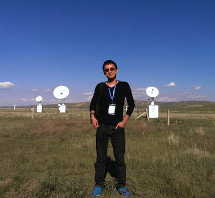

## About me

I am a **Junior Scientist**/**Postdoc** in the group [Astrophysical and Cosmological Relativity](http://www.aei.mpg.de/1282161/Astrophysical_and_Cosmological_Relativity), [Max Planck Institut für Gravitationsphysik (Albert Einstein Institut)](http://www.aei.mpg.de/) in Potsdam-Golm, Germany.

I am a member of [The Laser Interferometer Gravitational-Wave Observatory (LIGO) Scientific Collaboration](http://www.ligo.org/), and a member of [Pulsar Science Working Group](http://astronomers.skatelescope.org/science-working-groups/pulsars-tests-gravity/) of [The Square Kilometre Array (SKA)](https://www.skatelescope.org/).

I received a doctor degree, **Theoretical Physics 2015**, from [School of Physics](http://www.phy.pku.edu.cn/English.html), [Peking University](http://english.pku.edu.cn/) (Beijing, China), that was jointly fostered by [Max Planck Institut für Radioastronomie](http://www.mpifr-bonn.mpg.de/2169/en) (Bonn, Germany). Before that, I obtained a bachelor degree, **Physics 2010**, from [School of Physics](http://www.phy.pku.edu.cn/English.html), [Peking University](http://english.pku.edu.cn/), and a double degree, **Economics 2010**, from [National School of Development](http://en.nsd.edu.cn/), [Peking University](http://english.pku.edu.cn/).
