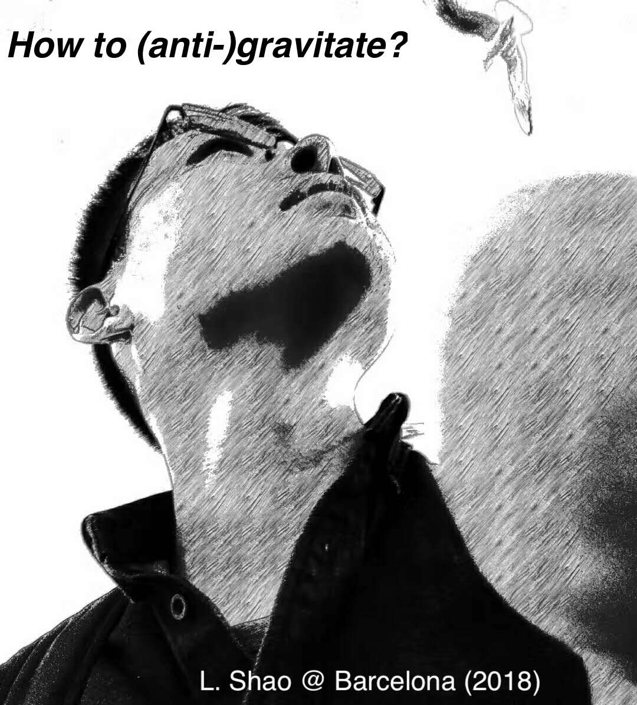

## About me

 

Currently I am a **Scientific Staff** in the group [Fundamental Physics in
Radio Astronomy](http://www3.mpifr-bonn.mpg.de/div/fundamental/index.html),
[Max Planck Institute for Radio
Astronomy](http://www.mpifr-bonn.mpg.de/2169/en) in Bonn, Germany. 

In the upcoming September, I will move to the [Kavli Institute for Astronomy
and Astrophysics](http://kiaa.pku.edu.cn/), [Peking
University](http://www.pku.edu.cn/) as a faculty member in Beijing, China.

I was a **Junior Scientist** in the group [Astrophysical and
Cosmological
Relativity](http://www.aei.mpg.de/1282161/Astrophysical_and_Cosmological_Relativity),
[Max Planck Institute for Gravitational Physics (Albert Einstein
Institute)](http://www.aei.mpg.de/) in Potsdam, Germany.

---

### Research Interests <small><small>([Group Members](http://friendshao.github.io/docs/people/))</small></small>

- Tests of gravity theories
- Gravitational waves
- Pulsars and neutron stars
- Astrophysical studies of dark matter
- Black hole spacetime
- Precision tests of fundamental physics
- Bayesian data analysis and statistics

---

### Contact

 **Friendshao****gmail.com**; lshaopku.edu.cn

 +49(0)228-525-505 (office)

 Max Planck Institute for Radio Astronomy, Auf
dem Hügel 69, D-53121 Bonn, Germany
