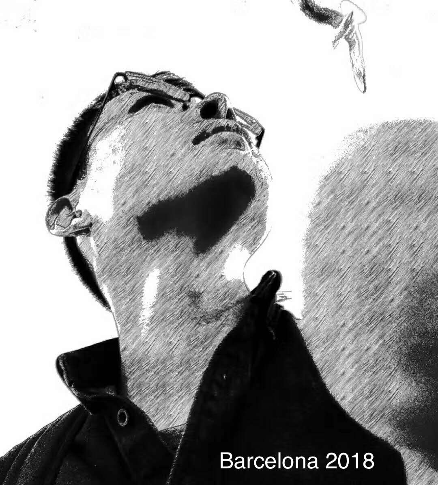

## About me

 

Since September 2018, I am an **Assistant Professor** in the [Kavli Institute
for Astronomy and Astrophysics](http://kiaa.pku.edu.cn/) at [Peking
University](http://www.pku.edu.cn/), Beijing China. 

After I obtained a doctor degree on **Theoretical Physics** from Peking
University in 2015, I spent two years as a **Junior Scientist** in the group
[Astrophysical and Cosmological
Relativity](http://www.aei.mpg.de/1282161/Astrophysical_and_Cosmological_Relativity),
[Max Planck Institute for Gravitational Physics (Albert Einstein
Institute)](http://www.aei.mpg.de/) in Potsdam, Germany. Then I spent one year
as a **Scientific Staff** in the group [Fundamental Physics in Radio
Astronomy](http://www3.mpifr-bonn.mpg.de/div/fundamental/index.html), [Max
Planck Institute for Radio Astronomy](http://www.mpifr-bonn.mpg.de/2169/en) in
Bonn, Germany. 

#### *Selected Professional Recognitions*

- Assistant Professor (助理教授/研究员) at [KIAA-PKU](http://kiaa.pku.edu.cn/people/lijing-shao-%E9%82%B5%E7%AB%8B%E6%99%B6)
- Elected to the Young Elite Scientists Sponsorship Program (青年人才托举工程) by the [CAST](http://www.cast.org.cn/)
- Invited to the Editorial Board of [Universe](https://www.mdpi.com/journal/universe/editors#editorialboard)
- Outstanding Reviewer for [Classical and Quantum Gravity](https://publishingsupport.iopscience.iop.org/questions/classical-and-quantum-gravity-2018-reviewer-awards/) and [Universe](https://www.mdpi.com/journal/universe/awards/591/download)

---

### Research Interests <small><small>([Research Group](https://kiaagravity.github.io))</small></small>

- Tests of gravity theories
- Gravitational waves
- Pulsars and neutron stars
- Astrophysical studies of dark matter
- Black hole spacetime
- Precision tests of fundamental physics
- Bayesian data analysis and statistics

**Office Time**: Tuesdays & Fridays 14:00-17:00 PM; *please drop me a message before visiting!*

---

### Contact

 **Friendshao****gmail.com**; lshaopku.edu.cn

 +86-(0)10-6275-8461 (office)

 Kavli Institute for Astronomy and
Astrophysics, Peking University, Beijing 100871, China
