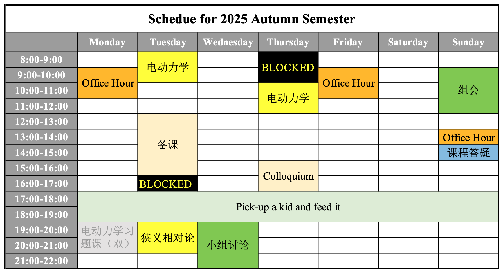
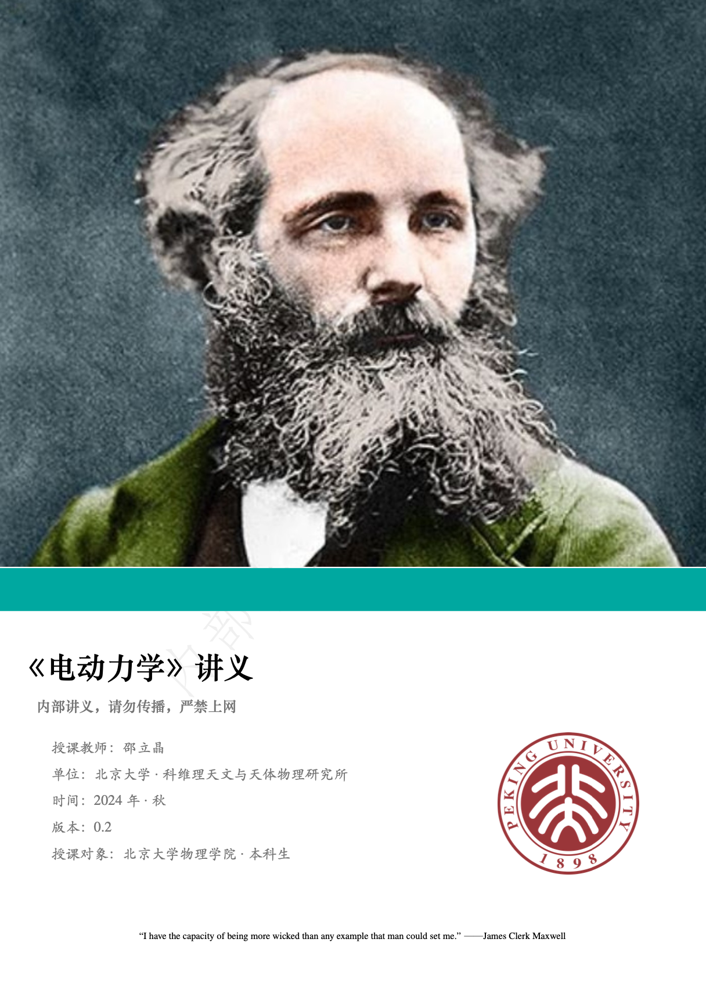
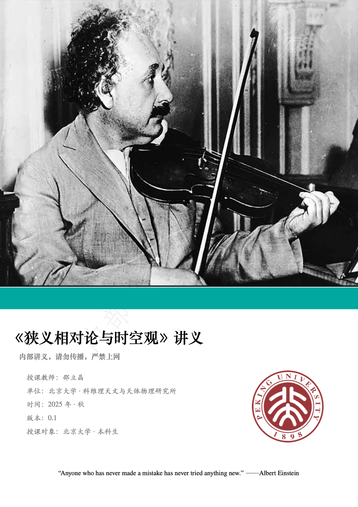

## <b>About me</b> &thinsp;&thinsp; 

 

I am an **Associate Professor with Tenure** (研究员/长聘副教授/博士生导师) in the [Kavli
Institute for Astronomy and Astrophysics](http://kiaa.pku.edu.cn/) at [Peking
University](http://www.pku.edu.cn/), Beijing China. 
&nbsp;  [**Academic Tree**](https://academictree.org/astronomy/peopleinfo.php?pid=913811)
&nbsp;  [**北大学者中文主页**](http://scholar.pku.edu.cn/lshao)

<!-- &nbsp; &nbsp; &nbsp; &nbsp;<big><b>找我做本科毕设的，请<a href="https://kiaagravity.github.io/assets/bachelor">猛戳这里</a>，谢谢！</b></big>（24年秋/冬） -->

---

### Professional Recognitions

- Boya Youth Scholar (博雅青年学者) at [Peking University](http://www.pku.edu.cn/)
- Alibaba [DAMO Academy Young Fellow](https://damo.alibaba.com/damo-academy-young-fellow) (达摩院青橙学者)
- Head of a [Max Planck Partner Group](http://kiaa.pku.edu.cn/info/1129/7050.htm)  between [KIAA](http://kiaa.pku.edu.cn/) and [MPIfR](http://www.mpifr-bonn.mpg.de/2169/en)
- Elected to the Young Elite Scientists Sponsorship Program (青年人才托举工程) by the [CAST](http://www.cast.org.cn/)
- Committee Member of [Gravitation and Relativistic Astrophysics Division](http://www.cps-net.org.cn/News/Content/show/id/5325.do), Chinese Physical Society
- [2020 Breakthrough Prize in Fundamental
  Physics](https://friendshao.github.io/docs/breakthrough_Certificate_2020.pdf) awarded to the EHTC (shared by 347 members)
- World's Top 2% Scientists [2020-2024](top2.png) ([data](https://elsevier.digitalcommonsdata.com/datasets/btchxktzyw/7))

### Research Interests

- Tests of gravity theories
- Gravitational waves
- Pulsars and neutron stars
- Black-hole spacetime & astrophysics
- Precision tests of fundamental physics
- Astrophysical studies of dark matter
- Machine learning, data analysis & statistics
- <b><i>Projects</i></b>: LIGO/Virgo/KAGRA, EHT, SKA, eXTP, *etc.*

### Want to join our research?

Please read the following articles carefully, for
**(a)** [Postdoc](https://kiaagravity.github.io/assets/postdoc) <small>(博后)</small>,
**(b)** [PhD Student](https://kiaagravity.github.io/assets/phd) <small>(博士生)</small>, 
**(c)** [Undergraduate Research Study](https://kiaagravity.github.io/assets/undergraduate) <small>(本科生科研)</small>, and 
**(d)** [Bachelor Dissertation](https://kiaagravity.github.io/assets/bachelor) <small>(本科生毕设)</small>.  
You can get more information from [current
members](https://kiaagravity.github.io/member/), [past
students](https://friendshao.github.io/docs/theses), and [this Q&A
sheet](https://kiaagravity.github.io/assets/QA).

  &nbsp;&nbsp; **For more, please check at [<big>our Group Page</big>](https://kiaagravity.github.io)**  

---

### Teaching

| &nbsp; &nbsp; <small>00433340</small> | &nbsp; &nbsp; &nbsp; 狭义相对论与时空观 | 2学分 | Special Relativity & Spacetime |
| &nbsp; &nbsp; <small>00407794</small> | &nbsp; &nbsp; &nbsp; 广义相对论与天体物理 &nbsp; &nbsp; &nbsp; | 2学分 &nbsp; &nbsp; &nbsp; | General Relativity & Astrophysics |
| &nbsp; &nbsp; <small>00432211</small> | &nbsp; &nbsp; &nbsp; 理论力学 | 3学分 | Theoretical Mechanics |
| &nbsp; &nbsp; <small>00432198</small> | &nbsp; &nbsp; &nbsp; 理论力学（A） | 4学分 | Theoretical Mechanics (A) |
| &nbsp; &nbsp; <small>00432213</small> | &nbsp; &nbsp; &nbsp; 电动力学 | 3学分 | Electrodynamics  |
| &nbsp; &nbsp; <small>00432140</small> | &nbsp; &nbsp; &nbsp; 电动力学（A） | 4学分 | Electrodynamics (A)  |
| &nbsp; &nbsp; <small>00432141</small> | &nbsp; &nbsp; &nbsp; 电动力学（B） | 3学分 | Electrodynamics (B)  |
| &nbsp; &nbsp; <small>00432001</small> | &nbsp; &nbsp; &nbsp; 理论物理基础（I） | 4学分 | Fundamentals of Theoretical Physics (I)  |
| &nbsp; &nbsp; <small>00431132</small> | &nbsp; &nbsp; &nbsp; 普通物理（I） | 4学分 | General Physics (I)  |
| &nbsp; &nbsp; <small>00431133</small> | &nbsp; &nbsp; &nbsp; 普通物理（II） | 4学分 | General Physics (II) |
| &nbsp; &nbsp; <small>00432296</small> | &nbsp; &nbsp; &nbsp; 天体粒子物理 | 2学分 | Astroparticle Physics |

&nbsp; 

&nbsp; 

&nbsp; 

<!-- 
| &nbsp; &nbsp; 广义相对论 &nbsp; &nbsp; &nbsp; | 4学分 &nbsp; &nbsp; &nbsp; | General Relativity |
| &nbsp; &nbsp; 狭义相对论  <small><small> *** 建设中</small></small> | 2学分 | Special Relativity |
| &nbsp; &nbsp; 百年物理  <small><small> *** 建设中</small></small> | 2学分 | Centenary Physics |
-->

<!-- 
### Contact

 **Email:** lshaopku.edu.cn
 
 **Tel:** +86-(0)10-6275-6630; **Fax:** +86-(0)10-6275-7900 (secretary)

 **Address:** K217, KIAA at Peking University, Beijing 100871, China

 **Group Meeting:** Sundays 9:00-11:00 AM (meeting room in auditorium)

 **Office Hours:** by appointments, please email me 
-->