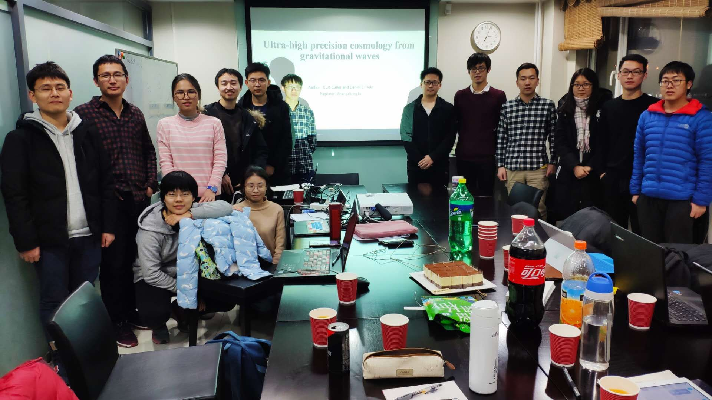

<big>**About Group Meetings**</big>

Group meeting provides a friendly environment to interact with other group
members or visiting scholars.  It also brings the opportunity to broaden views
in science, to learn different methods in solving problems, to strengthen the
capability in scientifically sound presentations, even to develop close
collaborations via inspiring discussions.

Our group meetings take place in the <b>meeting room on the 2nd floor at
KIAA</b>. To avoid conflicts with students' classes, the time is fixed to
<b>Saturday 9:00—11:00</b>.

  

<b>The Format</b>

  

1. General news (less than 5 minutes)  
2. Literature reading (strictly limited to 10+5 minutes)  
3. Paper presentation (about 1 hour)  
4. Updates on projects (indefinite time; those who are not involved are free to leave)  

 

<b>(*) Literature Reading (LR): </b>

Sometimes, you only have 10 minutes to explain the <b>main</b> idea of a paper!

 

<b>(*) Paper Presentation (PP): </b>

The presenter <b>MUST</b> inform the other group members the paper to be discussed
at least 5 days in advance. It is suggested to use English whenever
there are foreigners in the audience. Otherwise it is suggested to talk in
Chinese, but use English in slides.

We have a Journal Club **Gravitational Astrophysics** on
[benty-fields](https://benty-fields.com/). Everyone is free to join.

---

**2019**

- Feb 23, **Xueli Miao** (PP), [arXiv:1205.1450](https://arxiv.org/abs/1205.1450); 
          **Junjie Zhao** (LR), [arXiv:1010.5788](https://arxiv.org/abs/1010.5788)
  + (PP) *The relativistic pulsar-white dwarf binary PSR J1738+0333 II. The
    most stringent test of scalar-tensor gravity*, by P.C.C. Freire *et al.*
  + (LR) *A two-solar-mass neutron star measured using Shapiro delay*, by
    P.B. Demorest *et al.*
- Mar 2, **Zihang Wang** (PP); **Yong Gao** (LR),
  [arXiv:astro-ph/9605140](https://arxiv.org/abs/astro-ph/9605140)
  + (PP) ...
  + (LR) *Gravitational lensing of gravitational waves from merging neutron star binaries*, by Y. Wang, A. Stebbins, E.L. Turner
- Mar 9, **Dewang Xu** (PP); **Zhongfu Zhang** (LR),
  [arXiv:1901.06623](https://arxiv.org/abs/1901.06623)
  + (PP) ...
  + (LR) *John Archibald Wheeler: A biographical memoir*, by K.S. Thorne
- Mar 16, **Jiangwei Xu** (PP); **Xueli Miao** (LR)
  + (PP) ...
  + (LR) ...
- Mar 23, **Chang Liu** (PP); **Zihang Wang** (LR)
  + (PP) ...
  + (LR) ...
- Mar 30, **Junjie Zhao** (PP); **Dewang Xu** (LR)
  + (PP) ...
  + (LR) ...
- Apr 6, **Yong Gao** (PP),
  [1967ApJ...150.1005H](http://adsabs.harvard.edu/abs/1967ApJ...150.1005H); **Jiangwei Xu** (LR)
  + (PP) *Slowly rotating relativistic stars. I. Equations of structure*,
    by J.B. Hartle
  + (LR) ...

**Upcoming paper presenters (PP)**

0. Xueli Miao
0. Zihang Wang
0. Wenlong Li
0. Zhongpeng Sun
0. Zhongfu Zhang
0. Dewang Xu
0. Jiangwei Xu

**Upcoming literature readers (LR)**

0. Chang Liu
0. Junjie Zhao
0. Yong Gao
0. Xueli Miao
0. Zihang Wang
0. Wenlong Li
0. Zhongpeng Sun
0. Zhongfu Zhang
0. Dewang Xu
0. Jiangwei Xu

---

<big>**Archived**</big>

**2018**

- Oct 16, **Junjie Zhao**, [arXiv:1809.07673](https://arxiv.org/abs/1809.07673)
  + *Relaxation in a fuzzy dark matter halo*, by B. Bar-Or, J.-B.  Fouvry,
    S. Tremaine
- Oct 23, **Yong Gao**, [arXiv:0903.0338](https://arxiv.org/abs/0903.0338)
  + *Physics, astrophysics and cosmology with gravitational waves*
    (Chapters 1-3), by B.S. Sathyaprakash, B.F. Schutz
- Oct 30, **No Group Meeting**
- Nov 6, **Xueli Miao**,
  [arXiv:gr-qc/0109049](https://arxiv.org/abs/gr-qc/0109049) &
[arXiv:1805.10523](https://arxiv.org/abs/1805.10523)
  + *Bounding the mass of the graviton using binary pulsar observations*,
    by L.S. Finn, P.J. Sutton
  + *Solar system versus gravitational-wave bounds on the graviton mass*,
    by C.M. Will
- Nov 13, **Zihang Wang**, [arXiv:1708.08464](https://arxiv.org/abs/1708.08464)
  + *Probing axions with neutron star inspirals and other stellar processes*, by
    A. Hook, J. Huang
- Nov 20, **No Group Meeting**
- Nov 27, **No Group Meeting**
- Dec 4, **Junjie Zhao**,
  [Statistics](http://pdg.lbl.gov/2018/reviews/rpp2018-rev-statistics.pdf) in
*The Review of Particle Physics (2018)*
  +  *(Bayesian) Statistics*, by G. Cowan
- Dec 11, **Yong Gao**, [arXiv:1804.08583](https://arxiv.org/abs/1804.08583)
  + *Tidal deformabilities and radii of neutron stars from the observation
    of GW170817*, by S. De *et al.*
- Dec 18, **No Group Meeting**
- Dec 25, **Zhongfu Zhang**,
  [arXiv:0906.3752](https://arxiv.org/abs/0906.3752)
  + *Ultra-high precision cosmology from gravitational waves*, by C.
    Cutler, D.E. Holz
  + **Wenlong Li & Zhongpeng Sun**: rehearsal for the mid-term examination
    of bachelor theses

<figure>

<figcaption><b>Group meeting on December 25, 2018.</b></figcaption>
</figure>

