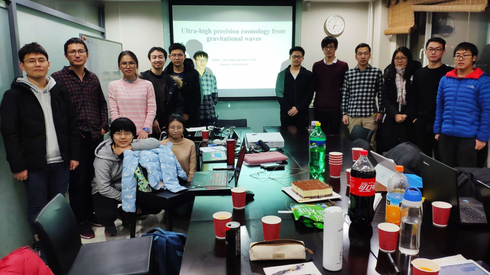

<big>**Welcome to Join our Research**</big>

I am interested in supervising **senior undergraduates**, and **graduates at
all levels**.  Those who are good at either mathematics or computer science are
especially encouraged. Students from other universities/institutions are also
welcome.  I would also like to hire **postdoctoral researchers**. If you are
interested in gravitational physics or searching for new physics from
astrophysical observations, please send your CV and I will help you in getting
a position when available. Please contact me!

<big>[**Group Meetings**](https://friendshao.github.io/docs/meetings)</big>

Our group meetings take place in **Room 208 at KIAA** on **Saturday
9:00—11:00**. All are welcome to attend!

<figure>

<figcaption><b>Group meeting on December 25, 2018.</b></figcaption>
</figure>

---

<big>**Current Members**</big>

| Time | Name | Status | Affiliation |
|:---:|:---:|
| 2018 — present | **Lijing Shao (邵立晶)** | Researcher / Assistant Professor | [KIAA-PKU](http://kiaa.pku.edu.cn/) |
| 2018 — present | **Yong Gao (高勇)** | PhD Student | [DoA-PKU](http://astro.pku.edu.cn/index/home.htm) |
| 2018 — present | **Junjie Zhao (赵俊杰)** | Joint Doctoral Thesis | [ITP-PKU](http://itp.phy.pku.edu.cn/) |
| 2018 — present | **Xueli Miao (缪雪丽)** | Joint Doctoral Thesis | [ITP-PKU](http://itp.phy.pku.edu.cn/) | 
| 2018 — present | **Zihang Wang (王子航)** | PhD Student | [DoA-PKU](http://astro.pku.edu.cn/index/home.htm) |
| 2018 — present | **Zhongfu Zhang (张中府)** | PhD Student | [DoA-PKU](http://astro.pku.edu.cn/index/home.htm) |
| 2018 — present | **Dewang Xu (徐德望)** | PhD Student | [DoA-PKU](http://astro.pku.edu.cn/index/home.htm) |
| 2018 — present | **Jiangwei Xu (徐江伟)** | PhD Student | [DoA-PKU](http://astro.pku.edu.cn/index/home.htm) |
| 2018 — present | **Chang Liu (刘畅)** | PhD Student | [DoA-PKU](http://astro.pku.edu.cn/index/home.htm) |
| 2018 — present | **Fan Hu (胡帆)** | PhD Student | [DoA-PKU](http://astro.pku.edu.cn/index/home.htm) |
| 2018 — present | **Wenxiu Li (李文秀)** | PhD Student | [DoA-PKU](http://astro.pku.edu.cn/index/home.htm) |
| 2019 — present | **Xuxiang Li (黎旭翔)** | PhD Student | [ITP-PKU](http://itp.phy.pku.edu.cn/) | 
| 2018 — present | **Zhongpeng Sun (孙忠鹏)** | Bachelor Thesis | [DoA-PKU](http://astro.pku.edu.cn/index/home.htm) |
| 2018 — present | **Wenlong Li (李汶隆)** | Bachelor Thesis | [DoA-PKU](http://astro.pku.edu.cn/index/home.htm) |
| 2018 — present | **Yacheng Kang (康亚城)** | Undergraduate | [DoA-PKU](http://astro.pku.edu.cn/index/home.htm) |
| 2018 — present | **Xiaojing Lin (林小靖)** | Undergraduate | [DoA-PKU](http://astro.pku.edu.cn/index/home.htm) |
| 2018 — present | **Huimei Wang (王惠美)** | Undergraduate | [DoA-PKU](http://astro.pku.edu.cn/index/home.htm) |
| 2019 — present | **Zhengrong Li (李政融)** | Undergraduate | [DoA-PKU](http://astro.pku.edu.cn/index/home.htm) |
| 2019 — present | **Tongxuan Zhang (张通烜)** | Undergraduate | [BIO-PKU](http://www.bio.pku.edu.cn/) |

