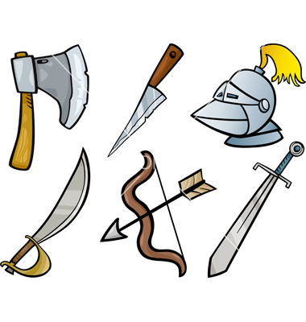

## General Purposes

- [anaconda](https://www.continuum.io/downloads): Anaconda
- [atom](https://atom.io/): A hackable text editor
- [bitbucket](https://bitbucket.org/): Code, Manage, Collaborate
- [bokeh](http://bokeh.pydata.org/): Python interactive visualization library
- [C/C++](http://www.cplusplus.com/): References to C/C++ libraries
- [dropbox](https://www.dropbox.com/home): dropbox
- [emacs](https://www.gnu.org/software/emacs/): An extensible, customizable, free/libre text editor — and more
- [gdb](https://www.gnu.org/software/gdb/): The GNU Project Debugger
- [George](http://dan.iel.fm/george/current/): a fast and flexible Python library for Gaussian Process Regression
- [git](https://git-scm.com/): git --everything-is-local
- [github](https://github.com/): git repositories
- [gnuplot](http://www.gnuplot.info/): Gnuplot
- [GSL](http://www.gnu.org/software/gsl/): GNU Scientific Library
- [Jupyter](http://jupyter.org/): jupyter
- [JupyterLab](http://jupyterlab-tutorial.readthedocs.io/en/latest/): jupyter lab
- [latex](https://www.latex-project.org/): LaTeX – A document preparation system
- [Mathematica](http://www.wolfram.com): Wolfram
- [matplotlib](http://matplotlib.org/): matplotlib
- [NumPy](http://www.numpy.org/): scientific computing with Python
- [pandas](http://pandas.pydata.org/): Python Data Analysis Library
- [Python](https://www.python.org/): python
- [R](https://www.r-project.org/): The R Project for Statistical Computing
- [ROOT](https://root.cern.ch/): modular scientific software framework
- [seaborn](https://stanford.edu/~mwaskom/software/seaborn/): statistical data visualization
- [SciPy](http://www.scipy.org/): Python-based ecosystem of open-source software for mathematics, science, and engineering
- [swig](http://www.swig.org/): Connect C/C++ with high-level programming languages
- [valgrind](http://valgrind.org/): Build dynamic analysis
- [vim](http://www.vim.org/): Vim - the ubiquitous text editor

## Toolbox

- [altair](https://github.com/ellisonbg/altair): Declarative statistical visualization library for Python
- [argparse](https://docs.python.org/3/howto/argparse.html): command-line parsing module in the Python standard library
- [asana](http://www.asana.com): asana task manager
- [astroblend](http://www.astroblend.com/): Combine artistic 3D models with computational astrophysics datasets and win the internet
- [astroML](https://github.com/astroML/astroML): Machine learning, statistics, and data mining for astronomy and astrophysics
- [astropy](http://www.astropy.org/): python library for astronomy
- [astroVis](https://bitbucket.org/Siggi_za/astrovis): visulizing astronomical data cubes
- [avoplot](https://github.com/jreeder/avoplot): An extensible scientific plotting tool based on matplotlib
- [bokeh-notebook](https://github.com/bokeh/bokeh-notebooks): Interactive Web Plotting with Bokeh in IPython notebook
- [celerite](https://github.com/dfm/celerite): Scalable 1D Gaussian Processes in C++, Python, and Julia
- [chainconsumer](https://github.com/Samreay/ChainConsumer): Corner plots, LaTeX tables and plotting walks
- [contbin](http://www-xray.ast.cam.ac.uk/papers/contbin/): Contour binning
- [corner](https://pypi.python.org/pypi/corner/1.0.0): Make some beautiful corner plots of samples
- [cosmoslik](https://github.com/marius311/cosmoslik): Cosmology Sampler of LIKelihoods
- [cuba](http://www.feynarts.de/cuba/): a library for multidimensional numerical integration
- [daft](http://daft-pgm.org/): BEAUTIFULLY RENDERED PROBABILISTIC GRAPHICAL MODELS
- [DALI](https://github.com/Lnasellentin/DALI): Non-Gaussian Likelihood Approximations
- [dedalus](http://dedalus-project.org/): A FLEXIBLE FRAMEWORK FOR SPECTRALLY SOLVING DIFFERENTIAL EQUATIONS
- [DNest4](https://github.com/eggplantbren/DNest4): Diffusive Nested Sampling
- [emcee](http://dan.iel.fm/emcee/): Affine Invariant Markov chain Monte Carlo Ensemble sampler
- [eob_ihes](https://eob.ihes.fr/): EOB IHES
- [FEniCS](https://fenicsproject.org/): computing platform for partial differential equations
- [Fluid](http://fluidapp.com/): Turn Your Favorite Web Apps into Real Mac Apps
- [gala](http://gala.adrian.pw/en/latest/): Python package for Galactic astronomy and gravitational dynamics
- [galkin](https://github.com/galkintool/galkin): A tool to handle the available data on the rotation curve of the Milky Way
- [GalPot](https://github.com/PaulMcMillan-Astro/GalPot): A stand-alone version of Dehnen's GalaxyPotential code
- [galpy](https://github.com/jobovy/galpy): Galactic Dynamics in python
- [gatspy](https://github.com/astroML/gatspy): General tools for Astronomical Time Series in Python
- [GRTensorII](http://grtensor.phy.queensu.ca/): GRTensorII
- [gwframe](https://github.com/moble/GWFrames): Manipulate gravitational waveforms—changing frames, and so on
- [gwpy](https://github.com/gwpy/gwpy): Package for analysing and characterising gravitational wave data in python
- [h5py](http://www.h5py.org/): HDF5 for Python
- [HAD](http://had.liu.edu/): Distributed AMR infrastructure for PDEs
- [ipywidgets](https://github.com/jupyter-widgets/ipywidgets): IPython widgets for the Jupyter Notebook
- [Jekyll](http://jekyllrb.com/): Transform your plain text into static websites and blogs
- [jrnl](http://jrnl.sh/): Collect your thoughts and notes without leaving the command line
- [lalsuite](https://github.com/lscsoft/lalsuite): LALSuite Mirror
- [lightning](http://lightning-viz.org/): API-based access to reproducible web visualizations
- [lisatools](https://github.com/vallis/lisatools): LISA tools
- [MCcubed](https://github.com/pcubillos/MCcubed): Python Differential Evolution MCMC
- [mesa](http://www.mesa3d.org/): The Mesa 3D Graphics Library
- [nbody](http://www.ast.cam.ac.uk/~sverre/web/pages/nbody.htm): collection of nbody codes
- [nbstripout](https://github.com/kynan/nbstripout): strip output from Jupyter and IPython notebooks
- [NX01](https://github.com/stevertaylor/NX01): Pulsar-timing array analysis code
- [O2scl](http://web.utk.edu/~asteine1/o2scl/): object-oriented scientific computing library
- [odes](https://github.com/bmcage/odes): The ODES scikit for ordinary differential and algebraic equations, an extension to scipy
- [odespy](http://hplgit.github.io/odespy/doc/pub/tutorial/html/): Odespy Interface to ODE Solvers
- [pandoc](http://pandoc.org/): a universal document converter
- [piccard](https://github.com/vhaasteren/piccard): pulsar timing data analysis package
- [PINT](https://github.com/nanograv/PINT): PINT is not TEMPO3 -- New software for high-precision pulsar timing
- [precession](https://github.com/dgerosa/precession): precession
- [pwkit](https://github.com/pkgw/pwkit/): miscellaneous Python for science and astronomy
- [pycbc](https://github.com/ligo-cbc/pycbc): Analyze gravitational-wave data, find signals, and study their parameters
- [pycodestyle](https://github.com/PyCQA/pycodestyle): Python style guide checker
- [pydde](https://github.com/hensing/PyDDE): Python/C DDE solver
- [pydelay](http://pydelay.sourceforge.net/): delay differential equations (DDEs)
- [pyMan](http://www.physics.nyu.edu/pine/pymanual/html/pymanMaster.html): Introduction to Python for Science
- [pynbody](https://github.com/pynbody/pynbody): N-body and hydro analysis tools for python 2 and 3
- [re](https://docs.python.org/3/howto/regex.html): Regular Expression
- [rebound](https://github.com/hannorein/rebound): An open-source multi-purpose N-body code
- [reboundx](https://github.com/dtamayo/reboundx): A library for adding additional forces to the REBOUND N-body integration package
- [reproject](https://reproject.readthedocs.io/en/stable/): Image reprojection
- [RGTC](http://www.inp.demokritos.gr/~sbonano/RGTC/): Riemannian Geometry & Tensor Calculus @ Mathematica
- [RNS](http://www.gravity.phys.uwm.edu/rns/): Rapidly rotating NSs
- [ROMSpline](https://bitbucket.org/chadgalley/romspline): compressing and interpolating 1d data using reduced-order modeling and statistical learning methods
- [sage](https://github.com/sagemath/sage): Mirror of the Sage source tree
- [scri](https://github.com/moble/scri/): manipulating time-dependent functions of spin-weighted spherical harmonics
- [simulationtools](http://simulationtools.org/): SimulationTools
- [slice_posterior](https://github.com/vivienr/slice_posterior): Slices and interpolate a LIGO CBC-PE posterior file
- [synthlisa](https://github.com/vallis/synthlisa): Synthetic LISA: a noise and signal simulator for LISA-like gravitational-wave observatories
- [tempo](http://nanograv.github.io/tempo/): pulsar timing data analysis
- [tempo2](http://www.atnf.csiro.au/research/pulsar/tempo2/): TEMPO2 pulsar timing package
- [tensorflow](https://www.tensorflow.org/): An open-source software library for Machine Intelligence
- [threading](https://pymotw.com/2/threading/): Manage concurrent threads
- [theano](http://deeplearning.net/software/theano/index.html): a Python library to define, optimize, and efficiently evaluate mathematical expressions involving multi-dimensional arrays
- [three.js](https://github.com/mrdoob/three.js): JavaScript 3D library
- [uncertainties](http://pythonhosted.org/uncertainties/): uncertainties package
- [vim fugitive](https://github.com/tpope/vim-fugitive): VIM fugitive
- [VisIt](https://wci.llnl.gov/simulation/computer-codes/visit/screenshots): data visualization
- [vpython](http://vpython.org/contents/docs/VisualIntro.html): Simple 3D Programming Using VPython
- [WebPlotDigitizer](https://github.com/ankitrohatgi/WebPlotDigitizer): HTML5 based online tool to extract numerical data from plot images
- [xAct](http://www.xact.es/): Efficient tensor computer algebra for the Wolfram Language
- [xAct-contrib](http://contrib.xact.es/): Community contributions to xAct
- [zotfile](http://zotfile.com/): Zotero plugin to manage your attachments
- [zsh](http://sourabhbajaj.com/mac-setup/iTerm/zsh.html): Zsh

## Datasets

- [Atom handbook](https://mba811.gitbooks.io/mac-dev/content/Atom/): atom handbook
- [B1913+16](https://zenodo.org/record/54764#.WN68ZBKGORt): Binary Pulsar PSR B1913+16 arrival time and associated files
- [Bayesian hackers](https://github.com/CamDavidsonPilon/Probabilistic-Programming-and-Bayesian-Methods-for-Hackers): Bayesian Methods for Hackers
- [cosmos gravity](http://aliojjati.github.io/MGCAMB/home.html): cosmological tests of modified gravity
- [CS231n](https://cs231n.github.io/): Convolutional Neural Networks for Visual Recognition
- [datadryad](http://www.datadryad.org/): Browse for data
- [eigenvalue](http://library.wolfram.com/infocenter/MathSource/8762/): Eigenvalue differential equation solver
- [EPTA](http://www.epta.eu.org/aom.html): EPTA additional online material
- [Exoplanets](http://exoplanets.org/): Exoplanet Data Explorer
- [eXTP](http://www.isdc.unige.ch/extp/): eXTP
- [figshare](https://figshare.com/): store, share, discover research
- [FRBcat](http://www.astronomy.swin.edu.au/pulsar/frbcat/): FRB catalog
- [GaTech NR](http://www.einstein.gatech.edu/catalog/): Einstein at Georgia Tech
- [High performance python](https://github.com/mynameisfiber/high_performance_python):  book "High Performance Python" by Micha Gorelick and Ian Ozsvald with OReilly
- [LVC NR](https://geo2.arcca.cf.ac.uk/~c1548640/LVC/lvcnrweb/): NR simulations for LVC
- [online MCMC](http://www.theonlinemcmc.com/): The online MCMC
- [Palettes](https://personal.sron.nl/~pault/): Palettes and templates
- [Physics hypertextbook](http://physics.info/): The Physics Hypertextbook
- [RIT NR](http://ccrg.rit.edu/~RITCatalog/): RIT catalog
- [supernova](https://sne.space/): The Open Supernova Catalog

