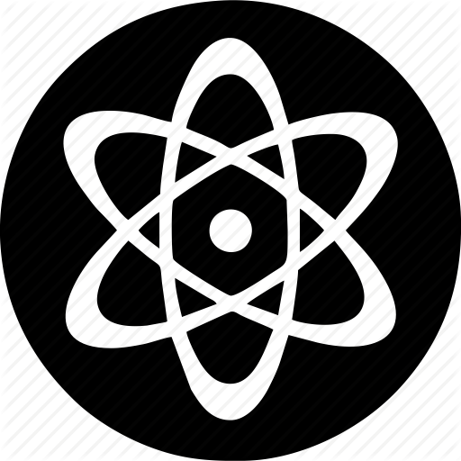

###  &nbsp;<b>Serving for Academic Journals</b> 

| **TIME** | **ROLE** |
| 2020-now |  Advisory Panel Member of [Classical and Quantum Gravity](https://iopscience.iop.org/journal/0264-9381/page/Advisory%20Panel) |
| 2024-2028 |  Editorial Board Member of [Chinese Physics C](http://cpc.ihep.ac.cn/) |
| 2024-2026 | Joint Youth Editorial Board Member [Chinese Physics Letters](https://iopscience.iop.org/journal/0256-307X), [Chinese Physics B](https://cpb.iphy.ac.cn/), [《物理学报》](https://wulixb.iphy.ac.cn/index.htm), [《物理》](http://www.wuli.ac.cn/) |
| 2024-now | Vice Principal of Science, Ditang Middle School, Yuyao China |
| 2018-now | Editorial Board Member of [Universe](https://www.mdpi.com/journal/universe/editors#editorialboard) |
| 2024-2025 | Special Issue Editor for *Symmetry* <small>[Symmetries in Compact Stars and Advances in Gravitational Waves](https://www.mdpi.com/journal/symmetry/special_issues/55L9VJ681U)</small> |
| | **PAST ROLE** |
| 2023-2024 | Guest Editor for [Science Bulletin](https://www.journals.elsevier.com/science-bulletin) and [《科学通报》](https://www.sciengine.com/CSB/home) |
| 2019-2022 | Executive Member of Editorial Board for [Science Bulletin](https://www.journals.elsevier.com/science-bulletin) |
| 2020-2022 | [MDPI](https://www.mdpi.com/) Open Science Ambassador |
| 2023-2024 | Special Issue Editor for *Universe* <small>[Newest Results in Gravitational Waves and Machine Learning](https://www.mdpi.com/journal/universe/special_issues/48U1E55JLC)</small> |
| 2023-2024 | Special Issue Editor for *Classical and Quantum Gravity* <small>[Focus on Pulsar Timing Arrays](https://iopscience.iop.org/collections/cqg-230802-310)</small> |
| 2023-2024 | Special Issue Editor for *Results in Physics* <small>[Physics of Gravitational Waves: Developments in Theory and Detection](https://www.sciencedirect.com/journal/results-in-physics/special-issue/107TZ5KRN12)</small> |
| 2021 | Special Issue Editor for *Universe* <small>[Selected Papers from the 1st International Electronic Conference on Universe](https://www.mdpi.com/journal/universe/special_issues/ecu2021)</small> |
| 2023 | IOP Trusted Reviewer for [IOP Publishing](https://accreditations.ioppublishing.org/ae33d146-240a-4f3a-94d3-0c5c72e3b873#gs.5181xs) |
| 2022 | Outstanding Reviewer for [SCIENCE CHINA: Physics, Mechanics & Astronomy](https://mp.weixin.qq.com/s/l0tT488ZYP1WjEwD5GlK9w) |
| 2020 | Outstanding Reviewer for [SCIENCE CHINA: Physics, Mechanics & Astronomy](https://mp.weixin.qq.com/s/u_07f_JjryUV_19NtKQECA) |
| 2019 | Outstanding Reviewer for [Classical and Quantum Gravity](https://publishingsupport.iopscience.iop.org/questions/classical-quantum-gravity-2019-reviewer-awards/) |
| 2018 | Outstanding Reviewer for [Classical and Quantum Gravity](https://publishingsupport.iopscience.iop.org/questions/classical-and-quantum-gravity-2018-reviewer-awards/) | 
| 2018 | Outstanding Reviewer for [Universe](https://www.mdpi.com/journal/universe/awards/591/download) |

 

###  &nbsp; <b>Serving for Academic Conferences</b>

| **ROLE** | **CONFERENCE** |
| SOC | [The 24th International Conference on General Relativity and Gravitation](https://iop.eventsair.com/gr24-amaldi16) <small>July 14-18, 2025, Glasgow UK |
| <small>&nbsp; Chair &nbsp;</small> Organizer | [SKA Pulsar Science Symposium 2025](https://psr.pku.edu.cn/conference/ska/ska2025/ska2025.html) <small>July 2-4, 2025, Qingdao China |
| Organizer | [3nd Topics of Particle, Astro and Cosmo Frontiers (TOPAC 2025)](https://indico-tdli.sjtu.edu.cn/event/3993/) <small>June 6-10, 2025, Guangzhou China |
| <small>&nbsp; Chair &nbsp;</small> Organizer | [The Ninth SKA Summer School](https://mp.weixin.qq.com/s/HiOYhzXwiRSHeepZZWS2BA) <small>August 11-18, 2024, Xi'an China |
| Organizer | [SKA Pulsar Science Symposium 2024](https://psr.pku.edu.cn/conference/ska/ska2024/ska2024.html) <small>July 12-14, 2024, Kunming China |
| Organizer | [2nd Topics of Particle, Astro and Cosmo Frontiers (TOPAC 2024)](https://indico-tdli.sjtu.edu.cn/event/2116/) <small>May 31 to June 2, 2024, Nanjing China |
| Organizer | [SKA Pulsar Science Symposium 2023](https://psr.pku.edu.cn/conference/ska/ska2023/ska2023.html) <small>July 2-4, 2023, Nanyang China |
| <small>&nbsp; Chair &nbsp;</small> Organizer | [SKA Pulsar Science Symposium 2022](https://psr.pku.edu.cn/conference/ska/ska2022/ska2022.html) <small>August 1-3, 2022, Xiangtan China |
| Organizer | [Workshop on Gravitational Wave Astrophysics for Early Career Scientists](https://www.lorentzcenter.nl/workshop-on-gravitational-wave-astrophysics-for-early-career-scientists.html) <small>May 3-7, 2021, Leiden Netherlands |
| Organizer | [The Future of Gravitational Wave Astrophysics](http://kiaa.pku.edu.cn/astroforum19/) <small>November 28-29, 2019, Beijing China |

 

<!-- 
| Co-organizer | [The Era When Pulsars Meet FRBs](https://psr.pku.edu.cn/conference/psrfrb/index.html) <small>May 11-16, 2025, Guizhou China  |
| Session Chair | [2024 International Congress of Basic Science](https://www.icbs.cn/) <small>July 14-26, 2024, Beijing China |
| Session Chair | [International Symposium on Cosmology and Particle Astrophysics CosPA 2024](https://indico.itp.ac.cn/event/198/) <small>June 14-18, 2024, Ningbo China |
| Co-organizer | [Dialog at the Dream Field: Supranuclear Matter](https://psr.pku.edu.cn/conference/fps/ddf/index.html) <small>May 10-15, 2024, Guiyang China  |
| Session Chair | [2nd International	Mini-Workshop on Gravitational	Waves	in	the	Early	Universe](https://indico.itp.ac.cn/event/217/) <small>April 8-11, 2024, Beijing China |
| Session Chair | 京海引力波论坛第一次会议 <small>April 4, 2024, 中国科学院力学所(怀柔园区), Beijing China |
| Session Chair | 第一届音频波段引力波天文学前沿学术研讨会 <small>March 29-April 1, 2024, Zhuhai China |
| Session Chair | MPG-CAS Collaboration Meeting on Low-frequency Gravitational Waves <small>August 2-5, 2023, Kunming China |
| Co-organizer Session Chair | [以天之语 解物之道](https://psr.pku.edu.cn/tianyujiewu/index.html) <small>June 26-27, 2023, 香山饭店, Beijing |
| Session Chair | [Annual Meeting of Gravitation and Relativistic Astrophysics](http://cqutp.org/conferences/gr23/) <small>April 21-25, 2023, Chongqing China |
| Co-organizer | [Mini Workshop on Compact Objects and Gravitational Waves](https://kiaa.pku.edu.cn/info/1026/8907.htm) <small>April 19, 2023, Beijing China |
| Session Chair | [FAST/Future Pulsar Symposium 11](https://psr.pku.edu.cn/fps/FPS11/FPS11.html) <small>August 3-5, 2022, Xiangtan China |
| Session Chair | [Ninth Meeting on CPT and Lorentz Symmetry](https://lorentz.sitehost.iu.edu/cpt22/) <small>May 17-26, 2022, Bloomington USA |
| Co-organizer | [The Postdoc Workshop on Gravitational Waves at KIAA: Fall 2022](https://kiaa.pku.edu.cn/info/1026/8621.htm) <small>October 29, 2022, Beijing China |
| Session Chair | [Annual Meeting of Gravitation and Relativistic Astrophysics](http://gra2020.csp.escience.cn/) <small>April 23-28, 2021, Shenyang China |
| Session Chair | [The 1st Electronic Conference on Universe](https://sciforum.net/conference/ECU2021) <small>February 22-28, 2021, Online|
| Session Chair | [Event Horizon Telescope 2020 Virtual Collaboration Meeting](https://eventhorizontelescope.teamwork.com/#/notebooks/202519) <small>December 4-14, 2020, Online|
| Session Chair | [AAPPS-DACG Workshop on Astrophysics, Cosmology and Gravitation](http://www.apctp.org/plan.php/AAPPS-dacg-Workshop) <small>November 9-13, 2020, Pohang Korea| 
| SOC Session Chair | [Gravitational Wave Astrophysics Conference 2019](http://3rd-gw-astro.csp.escience.cn/dct/page/65559) <small>August 13-17, 2019, Kunming China |
-->

---

 

###  &nbsp;  **Selected Outreach Videos** 

 

  

    

      <iframe src="//player.bilibili.com/player.html?&aid=113650203365955&bvid=BV1mmBjYbECb&cid=27336246219&p=1&autoplay=0&high_quality=1&danmaku=0" allowfullscreen="allowfullscreen" width="100%" height="140" scrolling="no" border="0" frameborder="no" framespacing="0" allowfullscreen="true" sandbox="allow-top-navigation allow-same-origin allow-forms allow-scripts"> </iframe>
      

        

        

        <h5><a href="https://www.bilibili.com/video/BV1mmBjYbECb/" target="_blank"><b>《聊个“天”》第5集</b></a></h5>
        
<small>央视 CCTV9 纪录片（2024）</small>

        

      

    

  

  

    

      <iframe src="//player.bilibili.com/player.html?aid=1455501889&bvid=BV11i421v7DS&cid=1575928636&p=1&autoplay=0&high_quality=1&danmaku=0" allowfullscreen="allowfullscreen" width="100%" height="140" scrolling="no" border="0" frameborder="no" framespacing="0" allowfullscreen="true" sandbox="allow-top-navigation allow-same-origin allow-forms allow-scripts"> </iframe>
      

        

        

        <h5><a href="https://www.bilibili.com/video/BV11i421v7DS" target="_blank"><b>《青春视界无极限》</b></a></h5>
        
<small>全国科技工作者日（2024）</small>

        

      

    

  

  

    

      <iframe src="//player.bilibili.com/player.html?isOutside=true&aid=833905716&bvid=BV1j34y1F7Lf&cid=1347141711&p=1&autoplay=0&high_quality=1&danmaku=0" allowfullscreen="allowfullscreen" width="100%" height="140" scrolling="no" border="0" frameborder="no" framespacing="0" allowfullscreen="true" sandbox="allow-top-navigation allow-same-origin allow-forms allow-scripts"> </iframe>
      

        

        

        <h5><a href="https://www.bilibili.com/video/BV1j34y1F7Lf" target="_blank"><b>科教片《宇宙来电》</b></a></h5>
        
<small>央视 CCTV10 纪录片（2023）</small>

        

      

    

  

  

    

      <iframe src="//player.bilibili.com/player.html?aid=347237775&bvid=BV1Rd4y1c71F&cid=878516437&page=1&autoplay=0&high_quality=1&danmaku=0" allowfullscreen="allowfullscreen" width="100%" height="140" scrolling="no" border="0" frameborder="no" framespacing="0" allowfullscreen="true" sandbox="allow-top-navigation allow-same-origin allow-forms allow-scripts"> </iframe>
      

        

        

        <h5><a href="https://www.bilibili.com/video/BV1Rd4y1c71F" target="_blank"><b>达摩院青橙学者宣传片</b></a></h5>
        
<small>阿里达摩院扫地僧（2022）</small>

        

      

    

  

  

    

      <iframe src="//player.bilibili.com/player.html?aid=718465423&bvid=BV1HQ4y1X7SM&cid=420240787&page=1&autoplay=0&high_quality=1&danmaku=0" allowfullscreen="allowfullscreen" width="100%" height="140" scrolling="no" border="0" frameborder="no" framespacing="0" allowfullscreen="true" sandbox="allow-top-navigation allow-same-origin allow-forms allow-scripts"> </iframe>
      

        

        

        <h5><a href="https://www.bilibili.com/video/BV1HQ4y1X7SM" target="_blank"><b>2021年诺贝尔物理学奖</b></a></h5>
        
<small>诺贝尔奖专家解读（2021）</small>

        

      

    

  

  

    

      <iframe src="//player.bilibili.com/player.html?aid=246058521&bvid=BV1yv411x7UM&cid=279329483&page=1&autoplay=0&high_quality=1&danmaku=0" allowfullscreen="allowfullscreen" width="100%" height="140" scrolling="no" border="0" frameborder="no" framespacing="0" allowfullscreen="true" sandbox="allow-top-navigation allow-same-origin allow-forms allow-scripts"> </iframe>
      

        

        

        <h5><a href="https://www.bilibili.com/video/BV1yv411x7UM" target="_blank"><b>《爱因斯坦对了吗？》</b></a></h5>
        
<small>中科院格致论道讲坛（2020）</small>

        

      

    

  

