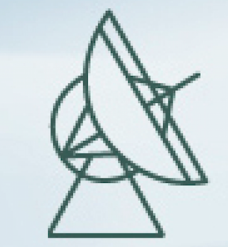

<!-- 

### **Publication Metrics**

| <small> (last updated: December 2022) | **CITATION** | **$H$-FACTOR** | **LINK** |
| **All Papers** | 40,000+ | 69 | [Inspirehep](https://inspirehep.net/literature?sort=mostrecent&size=25&page=1&q=author%3ALi.Jing.Shao.1#with-citation-summary) |
| **Short-author-list Papers** | 3,000+ | 29 | [Inspirehep](https://inspirehep.net/literature?sort=mostrecent&size=25&page=1&q=author%3ALi.Jing.Shao.1%20AND%20not%20cn%3A%2A&ui-citation-summary=true) |

--- -->

## <b>Publication</b>

**For a nearly complete list, please check at [<big><big>This Link</big></big>](https://friendshao.github.io/docs/publist), or [ADS](https://ui.adsabs.harvard.edu/#/public-libraries/_Wy76FR4TQutMoiU0wKO_g) / [Inspirehep](https://inspirehep.net/literature?sort=mostrecent&size=25&page=1&q=author%3ALi.Jing.Shao.1#with-citation-summary)**

- [**All Papers**](https://inspirehep.net/literature?sort=mostrecent&size=25&page=1&q=author%3ALi.Jing.Shao.1#with-citation-summary): $40000+$ citations with $H=70+$ 
- [**Short-author-list Papers**](https://inspirehep.net/literature?sort=mostrecent&size=25&page=1&q=author%3ALi.Jing.Shao.1%20AND%20not%20cn%3A%2A&ui-citation-summary=true): $3000+$ citations with $H=30$

---

### **Selected Short-author-list Papers**

0. **L. Shao**, [Combined search for anisotropic birefringence in the
gravitational-wave transient catalog GWTC-1](https://arxiv.org/abs/2002.01185),
*Phys. Rev. D* 101 (2020) 104019

0. A. Weltman, P. Bull, S.  Camera, K. Kelley, H. Padmanabhan, J. Pritchard, A.
Raccanelli, S.  Riemer-Sørensen, **L. Shao**, *et al.*, [Fundamental physics
with the Square Kilometre Array](https://arxiv.org/abs/1810.02680), *Publ.
Astron. Soc. Aust.* 37 (2020) e002

0. X. Liu, Z. Cao, **L. Shao**, [Validating the effective-one-body
numerical-relativity waveform models for spin-aligned binary black holes along
eccentric orbits](https://arxiv.org/abs/1910.00784), *Phys. Rev. D* 101 (2020)
044049

0. A. Caputo, L. Sberna, M. Frias, D. Blas, P. Pani, **L. Shao**, W. Yan,
[Constraints on millicharged dark matter and axionlike particles from timing of
radio waves](https://arxiv.org/abs/1902.02695), *Phys.  Rev. D* 100 (2019)
063515

0. **L. Shao**, N.  Sennett, A. Buonanno, M. Kramer, N. Wex, [Constraining
nonperturbative strong-field effects in scalar-tensor gravity by combining
pulsar timing and laser-interferometer gravitational-wave
detectors](https://arxiv.org/abs/1704.07561), *Phys. Rev. X* 7 (2017) 041025

0. A. Bohé, **L.  Shao**, A. Taracchini, A. Buonanno, *et al.*, [Improved
effective-one-body model of spinning, nonprecessing binary black holes for the
era of gravitational-wave astrophysics with advanced
detectors](https://arxiv.org/abs/1611.03703), *Phys. Rev. D* 95 (2017) 044028

0. **L. Shao**, N.  Wex, [Tests of gravitational symmetries with radio
pulsars](https://arxiv.org/abs/1604.03662), *Sci. China Phys. Mech. Astron.* 59
(2016) 699501

0. **L. Shao**, I.H.  Stairs, *et al.*, [Testing gravity with pulsars in the SKA
era](https://arxiv.org/abs/1501.00058), *PoS* (AASKA14) 042

0. **L. Shao**, [New pulsar limit on local Lorentz invariance violation of
gravity in the standard-model extension](https://arxiv.org/abs/1412.2320),
*Phys. Rev. D* 90 (2014) 122009

0. **L. Shao**, [Tests of local Lorentz invariance violation of gravity in the
standard model extension with pulsars](https://arxiv.org/abs/1402.6452), *Phys.
Rev. Lett.* 112 (2014) 111103

0. **L. Shao**, R.N.  Caballero, M. Kramer, N. Wex, D.J. Champion, A. Jessner,
[A new limit on local Lorentz invariance violation of gravity from solitary
pulsars](https://arxiv.org/abs/1307.2552), *Class. Quantum Grav.* 30 (2013)
165019

0. **L. Shao**, N.  Wex, [New tests of local Lorentz invariance of gravity with
small-eccentricity binary pulsars](https://arxiv.org/abs/1209.4503), *Class.
Quantum Grav.* 29 (2012) 215018

0. **L. Shao**, B.-Q. Ma, [Lorentz violation effects on astrophysical
propagation of very high energy photons](https://arxiv.org/abs/1007.2269), *Mod.
Phys. Lett. A* 25 (2010) 3251

0. **L. Shao**, Z. Xiao, B.-Q.  Ma, [Lorentz violation from cosmological objects
with very high energy photon emissions](https://arxiv.org/abs/0911.2276),
*Astropart. Phys.* 33 (2010) 312

{: reversed="reversed"}

<!-- ### **Short-author-list Papers** <small><small>(incomplete)

- Liang D, **Shao L**, 2023, 
  <a href="https://doi.org/10.1088/1475-7516/2023/08/016" style="color: #00bfff;">JCAP</a>, 08, 016
- Gao Y, **Shao L**, Steinhoff J, 2023,
  <a href="https://doi.org/10.3847/1538-4357/ace776" style="color: #00bfff;">ApJ</a>, 954, 16
- Yuan M, Zhu W, Kramer M, Peng B, Lu J, Xu R, **Shao L**, Wang H-G, *et al*, 2023,
  <a href="https://doi.org/10.3847/1538-4357/accb9a" style="color: #00bfff;">ApJ</a>, 949, 115 
- Xu R, Liang D, **Shao L**, 2023,
  <a href="https://doi.org/10.3847/1538-4357/acbdfb" style="color: #00bfff;">ApJ</a>, 945, 148 
- Zhu J-P, Wu S, Yang Y-P, Liu C, Zhang B, Song H-R, Gao H, Cao Z, Yu Y-W, Kang Y, **Shao L**, 2023, 
  <a href="https://doi.org/10.3847/1538-4357/aca527" style="color: #00bfff;">ApJ</a>, 942, 88 
- Gao Y, **Shao L**, Desvignes G, Jones D I, Kramer M, Yim G, 2023,
  <a href="https://doi.org/10.1093/mnras/stac3546" style="color: #00bfff;">MNRAS</a>, 519, 1080
- Abbate F, Noutsos A, Desvignes G, Wharton R, Torne P, Kramer M, Eatough R P, Karuppusamy R, Liu K, **Shao L**, Wongphecauxson J, 2023,
  <a href="https://doi.org/10.1093/mnras/stad2047" style="color: #00bfff;">MNRAS</a>, 524, 2966
- Mai Z-F, Xu R, Liang D, **Shao L**, 2023, 
  <a href="https://doi.org/10.1103/PhysRevD.108.024004" style="color: #00bfff;">Phys. Rev. D</a>, 108, 024004
- Haegel L, O'Neal-Ault K, Bailey Q G, Tasson J, Bloom M, **Shao L**, 2023, 
  <a href="https://doi.org/10.1103/PhysRevD.107.064031" style="color: #00bfff;">Phys. Rev. D</a>, 107, 064031
- Xu R, Liang D, **Shao L**, 2023, 
  <a href="https://doi.org/10.1103/PhysRevD.107.024011" style="color: #00bfff;">Phys. Rev. D</a>, 107, 024011
- Liang D, Xu R, Mai Z-F, **Shao L**, 2023, 
  <a href="https://doi.org/10.1103/PhysRevD.107.044053" style="color: #00bfff;">Phys. Rev. D</a>, 107, 044053
- Bayle J-B, Bonga B, Caprini C, Doneva D, Muratore M, Petiteau A, Rossi E, **Shao L**, 2022,
  <a href="https://doi.org/10.1038/s41550-022-01847-0" style="color: #00bfff;">Nat. Astron.</a>, 6, 1334
- **Shao L**, Yagi K, 2022,
  <a href="https://doi.org/10.1016/j.scib.2022.09.018" style="color: #00bfff;">Sci. Bull.</a>, 67, 1946
- Dong Y, **Shao L**, Hu Z, Miao X, Wang Z, 2022, 
  <a href="https://doi.org/10.1088/1475-7516/2022/11/051" style="color: #00bfff;">JCAP</a>, 11, 051
- Liu C, Kang Y, **Shao L**, 2022,
  <a href="https://doi.org/10.3847/1538-4357/ac7a39" style="color: #00bfff;">ApJ</a>, 934, 84
- Liu C, **Shao L**, 2022,
  <a href="https://doi.org/10.3847/1538-4357/ac3cbf" style="color: #00bfff;">ApJ</a>, 926, 158
- Wang Z, Liu C, Zhao J, **Shao L**, 2022,
  <a href="https://doi.org/10.3847/1538-4357/ac6b99" style="color: #00bfff;">ApJ</a>, 932, 102
- Kang Y, Liu C, **Shao L**, 2022,
  <a href="https://doi.org/10.1093/mnras/stac1738" style="color: #00bfff;">MNRAS</a>, 515, 739
- Gao Y, Lai X-Y, **Shao L**, Xu R-X, 2022,
  <a href="https://doi.org/10.1093/mnras/stab3181" style="color: #00bfff;">MNRAS</a>, 509, 2758
- Li H-B, Gao Y, **Shao L**, Xu R-X, 2022,
  <a href="https://doi.org/10.1093/mnras/stac2622" style="color: #00bfff;">MNRAS</a>, 516, 6172
- Liang D, Xu R, Lu X, **Shao L**, 2022,
  <a href="https://doi.org/10.1103/PhysRevD.106.124019" style="color: #00bfff;">Phys. Rev. D</a>, 106, 124019
- Wang Z, **Shao L**, 2022,
  <a href="https://doi.org/10.1103/PhysRevD.106.103504" style="color: #00bfff;">Phys. Rev. D</a>, 106, 103504
- Wang Y-F, Brown S M, **Shao L**, Zhao W, 2022,
  <a href="https://doi.org/10.1103/PhysRevD.106.084005" style="color: #00bfff;">Phys. Rev. D</a>, 106, 084005
- Akbarieh A R, Kazempour S, **Shao L**, 2022,
  <a href="https://doi.org/10.1103/PhysRevD.105.023501" style="color: #00bfff;">Phys. Rev. D</a>, 105, 023501
- Xu R, Gao Y, **Shao L**, 2022,
  <a href="https://doi.org/10.1103/PhysRevD.105.024003" style="color: #00bfff;">Phys. Rev. D</a>, 105, 024003
- Kazempour S, Akbarieh A R, Motavalli H, **Shao L**, 2022,
  <a href="https://doi.org/10.1103/PhysRevD.106.023508" style="color: #00bfff;">Phys. Rev. D</a>, 106, 023508
- Wang Z, Zhao J, An Z, **Shao L**, Cao Z, 2022,
  <a href="https://doi.org/10.1016/j.physletb.2022.137416" style="color: #00bfff;">Phys. Lett. B</a>, 834, 137416
- Zhao J, Freire P C C, Kramer M, **Shao L**, Wex N, 2022,
  <a href="https://doi.org/10.1088/1361-6382/ac69a3" style="color: #00bfff;">Class. Quantum Grav.</a>, 39, 11LT01
- Liu M, Liu C, Hu Y-M, **Shao L**, Kang Y, 2022,
  <a href="https://doi.org/10.1016/j.dark.2022.101136" style="color: #00bfff;">Phys. Dark Univ.</a>, 38, 101136
- **Shao L**, 2021,
  <a href="https://physics.aps.org/articles/v14/173" style="color: #00bfff;">Physics</a>, 14, 173
- Allahyari A, **Shao L**, 2021,
  <a href="https://doi.org/10.1088/1475-7516/2021/10/003" style="color: #00bfff;">JCAP</a>, 10, 003
- Kang Y, Liu C, **Shao L**, 2021,
  <a href="https://doi.org/10.3847/1538-3881/ac23d8" style="color: #00bfff;">AJ</a>, 162, 247
- Wang Z, **Shao L**, Liu C, 2021,
  <a href="https://doi.org/10.3847/1538-4357/ac223c" style="color: #00bfff;">ApJ</a>, 921, 158
- Miao X, Xu H, **Shao L**, Liu C, Ma B-Q, 2021,
  <a href="https://doi.org/10.3847/1538-4357/ac1d48" style="color: #00bfff;">ApJ</a>, 921, 114
- Zhang F, Chen X, **Shao L**, Inayoshi K, 2021,
  <a href="https://doi.org/10.3847/1538-4357/ac2c07" style="color: #00bfff;">ApJ</a>, 923, 139
- Guo M, Zhao J, **Shao L**, 2021,
  <a href="https://doi.org/10.1103/PhysRevD.104.104065" style="color: #00bfff;">Phys. Rev. D</a>, 104, 104065
- Hu Z, Gao Y, Xu R, **Shao L**, 2021,
  <a href="https://doi.org/10.1103/PhysRevD.104.104014" style="color: #00bfff;">Phys. Rev. D</a>, 104, 104014
- Aslmarand S M, Akbarieh A R, Izadi Y, Kazempour S, **Shao L**, 2021,
  <a href="https://doi.org/10.1103/PhysRevD.104.083543" style="color: #00bfff;">Phys. Rev. D</a>, 104, 083543
- Zhao J, **Shao L**, Gao Y, Liu C, Cao Z, Ma B-Q, 2021,
  <a href="https://doi.org/10.1103/PhysRevD.104.084008" style="color: #00bfff;">Phys. Rev. D</a>, 104, 084008
- Li S-L, **Shao L**, Wu P, Yu H, 2021,
  <a href="https://doi.org/10.1103/PhysRevD.104.043510" style="color: #00bfff;">Phys. Rev. D</a>, 104, 043510
- Wang Z, **Shao L**, 2021,
  <a href="https://doi.org/10.1103/PhysRevD.103.116021" style="color: #00bfff;">Phys. Rev. D</a>, 103, 116021
- Akbarieh A R, Kazempour S, **Shao L**, 2021,
  <a href="https://doi.org/10.1103/PhysRevD.103.123518" style="color: #00bfff;">Phys. Rev. D</a>, 103, 123518
- Xu R, Gao Y, **Shao L**, 2021,
  <a href="https://doi.org/10.1103/PhysRevD.103.084028" style="color: #00bfff;">Phys. Rev. D</a>, 103, 084028
- Xia H, **Shao L**, Zhao J, Cao Z, 2021,
  <a href="https://doi.org/10.1103/PhysRevD.103.024040" style="color: #00bfff;">Phys. Rev. D</a>, 103, 024040
- Wang H, Miao X, **Shao L**, 2021,
  <a href="https://doi.org/10.1016/j.physletb.2021.136596" style="color: #00bfff;">Phys. Lett. B</a>, 820, 136596
- Wang Z, **Shao L**, Li L-X, 2020,
  <a href="https://doi.org/10.1088/1475-7516/2020/07/038" style="color: #00bfff;">JCAP</a>, 07, 038
- Miao X, Zhao J, **Shao L**, Wex N, Kramer M, Ma B-Q, 2020,
  <a href="https://doi.org/10.3847/1538-4357/ab9dfe" style="color: #00bfff;">ApJ</a>, 898, 69
- Liu K, Guillemot L, Istrate A G, **Shao L**, Tauris T M, Wex N, *et al*, 2020,
  <a href="https://doi.org/10.1093/mnras/staa2993" style="color: #00bfff;">MNRAS</a>, 499, 2276
- Gao Y, **Shao L**, Xu R, Sun L, Liu C, Xu R-X, 2020,
  <a href="https://doi.org/10.1093/mnras/staa2476" style="color: #00bfff;">MNRAS</a>, 498, 1826
- Liu C, **Shao L**, Zhao J, Gao Y, 2020,
  <a href="https://doi.org/10.1093/mnras/staa1512" style="color: #00bfff;">MNRAS</a>, 496, 182
- Wang K, Xi S-Q, **Shao L**, Liu R-Y, Li Z, Zhang Z-K, 2020,
  <a href="https://doi.org/10.1103/PhysRevD.102.063027" style="color: #00bfff;">Phys. Rev. D</a>, 102, 063027
- Xu R, Gao Y, **Shao L**, 2020,
  <a href="https://doi.org/10.1103/PhysRevD.102.064057" style="color: #00bfff;">Phys. Rev. D</a>, 102, 064057
- **Shao L**, Wex N, Zhou S-Y, 2020,
  <a href="https://doi.org/10.1103/PhysRevD.102.024069" style="color: #00bfff;">Phys. Rev. D</a>, 102, 024069
- **Shao L**, 2020,
  <a href="https://doi.org/10.1103/PhysRevD.101.104019" style="color: #00bfff;">Phys. Rev. D</a>, 101, 104019
- Liu X, Cao Z, **Shao L**, 2020,
  <a href="https://doi.org/10.1103/PhysRevD.101.044049" style="color: #00bfff;">Phys. Rev. D</a>, 101, 044049
- Xu R, Zhao J, **Shao L**, 2020,
  <a href="https://doi.org/10.1016/j.physletb.2020.135283" style="color: #00bfff;">Phys. Lett. B</a>, 803, 135283
- Weltman A, Bull P, Camera S, Kelley K, Padmanabhan H, Pritchard J, Raccanelli A, Riemer-Sørensen S, **Shao L**, *et al*, 2020,
  <a href="https://doi.org/10.1017/pasa.2019.42" style="color: #00bfff;">PASA</a>, 37, e002
- Xiao Z, **Shao L**, 2020,
  <a href="https://doi.org/10.1088/1361-6471/ab8c30" style="color: #00bfff;">J. Phys. G</a>, 47, 085002
- Zhang F, **Shao L**, Zhu W, 2019,
  <a href="https://doi.org/10.3847/1538-4357/ab1b28" style="color: #00bfff;">ApJ</a>, 877, 87
- Sun B, Cao Z, **Shao L**, 2019,
  <a href="https://doi.org/10.1103/PhysRevD.100.084030" style="color: #00bfff;">Phys. Rev. D</a>, 100, 084030
- Zhao J, **Shao L**, Cao Z, Ma B-Q, 2019,
  <a href="https://doi.org/10.1103/PhysRevD.100.064034" style="color: #00bfff;">Phys. Rev. D</a>, 100, 064034
- Caputo A, Sberna L, Frias M, Blas D, Pani P, **Shao L**, Yan W, 2019,
  <a href="https://doi.org/10.1103/PhysRevD.100.063515" style="color: #00bfff;">Phys. Rev. D</a>, 100, 063515
- Miao X, **Shao L**, Ma B-Q, 2019,
  <a href="https://doi.org/10.1103/PhysRevD.99.123015" style="color: #00bfff;">Phys. Rev. D</a>, 99, 123015
- **Shao L**, Bailey Q G, 2019, 
  <a href="https://doi.org/10.1103/PhysRevD.99.084017" style="color: #00bfff;">Phys. Rev. D</a>, 99, 084017
- Gong B P, Li Y P, Yuan J P, Tian J, Zhang Y Y, Li D, Jiang B, Li X D, Wang H G, Zou Y C, **Shao L**, 2018,
  <a href="https://doi.org/10.3847/1538-4357/aaac34" style="color: #00bfff;">ApJ</a>, 855, 35
- Wu Y W, Torricelli-Ciamponi G, Massi M, Reid R J, Zhang B, **Shao L**, Zheng X W, 2018,
  <a href="https://doi.org/10.1093/mnras/stx3003" style="color: #00bfff;">MNRAS</a>, 474, 4245
- **Shao L**, Wex N, Kramer M, 2018,
  <a href="https://doi.org/10.1103/PhysRevLett.120.241104" style="color: #00bfff;">Phys. Rev. Lett.</a>, 120, 241104
- **Shao L**, Bailey Q G, 2018,
  <a href="https://doi.org/10.1103/PhysRevD.98.084049" style="color: #00bfff;">Phys. Rev. D</a>, 98, 084049
- **Shao L**, Sennett N, Buonanno A, Kramer M, Wex N, 2017,
  <a href="https://doi.org/10.1103/PhysRevX.7.041025" style="color: #00bfff;">Phys. Rev. X</a>, 7, 041025
- **Shao L**, Zhang B, 2017,
  <a href="https://doi.org/10.1103/PhysRevD.95.123010" style="color: #00bfff;">Phys. Rev. D</a>, 95, 123010
- Sennett N, **Shao L**, Steinhoff J, 2017,
  <a href="https://doi.org/10.1103/PhysRevD.96.084019" style="color: #00bfff;">Phys. Rev. D</a>, 96, 084019
- Bohé A, **Shao L**, Taracchini A, Buonanno A, *et al*, 2017,
  <a href="https://doi.org/10.1103/PhysRevD.95.044028" style="color: #00bfff;">Phys. Rev. D</a>, 95, 044028
- **Shao L**, 2017,
  <a href="https://doi.org/10.1088/1361-6382/aa8124" style="color: #00bfff;">Class. Quantum Grav.</a>, 34, 175011
- **Shao L**, 2016,
  <a href="https://doi.org/10.1103/PhysRevD.93.084023" style="color: #00bfff;">Phys. Rev. D</a>, 93, 084023
- **Shao L**, Stairs I H, *et al*, 2015,
  <a href="https://doi.org/10.22323/1.215.0042" style="color: #00bfff;">PoS</a>, AASKA14, 042
- **Shao L**, 2014,
  <a href="https://doi.org/10.1103/PhysRevLett.112.111103" style="color: #00bfff;">Phys. Rev. Lett.</a>, 112, 111103
- **Shao L**, 2014,
  <a href="https://doi.org/10.1103/PhysRevD.90.122009" style="color: #00bfff;">Phys. Rev. D</a>, 90, 122009
- **Shao L**, Wex N, 2013,
  <a href="https://doi.org/10.1088/0264-9381/30/16/165020" style="color: #00bfff;">Class. Quantum Grav.</a>, 30, 165020
- **Shao L**, Caballero R N, Kramer M, Wex N, Champion D J, Jessner A, 2013,
  <a href="https://doi.org/10.1088/0264-9381/30/16/165019" style="color: #00bfff;">Class. Quantum Grav.</a>, 30, 165019
- **Shao L**, Wex N, 2012,
  <a href="https://doi.org/10.1088/0264-9381/29/21/215018" style="color: #00bfff;">Class. Quantum Grav.</a>, 29, 215018
- **Shao L**, Ma B-Q, 2011,
  <a href="https://doi.org/10.1103/PhysRevD.83.127702" style="color: #00bfff;">Phys. Rev. D</a>, 83, 127702
- Zhang X, **Shao L**, Ma B-Q, 2011,
  <a href="https://doi.org/10.1016/j.astropartphys.2011.03.001" style="color: #00bfff;">Astropart. Phys.</a>, 34, 840
- **Shao L**, Ma B-Q, 2010,
  <a href="https://doi.org/10.1103/PhysRevE.82.041110" style="color: #00bfff;">Phys. Rev. E</a>, 82, 041110
- **Shao L**, Ma B-Q, 2010,
  <a href="https://doi.org/10.1016/j.physletb.2010.02.049" style="color: #00bfff;">Phys. Lett. B</a>, 686, 136
- Xiao Z, **Shao L**, Ma B-Q, 2010,
  <a href="https://doi.org/10.1140/epjc/s10052-010-1502-4" style="color: #00bfff;">Eur. Phys. J. C</a>, 70, 1153
- **Shao L**, Xiao Z, Ma B-Q, 2010,
  <a href="https://doi.org/10.1016/j.astropartphys.2010.03.003" style="color: #00bfff;">Astropart. Phys.</a>, 33, 312
- **Shao L**, Ma B-Q, 2010,
  <a href="https://doi.org/10.1016/j.astropartphys.2010.02.003" style="color: #00bfff;">Astropart. Phys.</a>, 33, 255
- Zhang Y, **Shao L**, Ma B-Q, 2009,
  <a href="https://doi.org/10.1016/j.physletb.2008.11.033" style="color: #00bfff;">Phys. Lett. B</a>, 671, 30
- Zhang Y, **Shao L**, Ma B-Q, 2009,
  <a href="https://doi.org/10.1016/j.nuclphysa.2009.07.006" style="color: #00bfff;">Nucl. Phys. A</a>, 828, 390 -->

<!-- ### **Selected First-author/Corresponding-author Papers**

0. R. Xu, D. Liang, **L.  Shao**, [Static spherical vacuum solutions in the
bumblebee gravity model](https://arxiv.org/abs/2209.02209), *Phys. Rev. D* 107
(2023) 024011

0. Y. Gao, **L.  Shao**, G. Desvignes, D.I. Jones, M. Kramer, G. Yim,
[Precession of magnetars: dynamical evolutions and modulations on polarized
electromagnetic waves](https://arxiv.org/abs/2211.17087), *Mon. Not.  R. Astron.
Soc.* 519 (2023) 1080

0. **L. Shao**, K. Yagi, [Neutron stars as extreme laboratories for gravity
tests](https://arxiv.org/abs/2209.03351), *Sci. Bull.* 67 (2022) 1946
- <small>Featured by Science Bulletin:
    [link](https://mp.weixin.qq.com/s/XzI8A_mOEGkHQIt-KPXn5A)
    

0. D. Liang, R. Xu, X. Lu, **L. Shao**, [Polarizations of gravitational waves in
the bumblebee gravity model](http://arxiv.org/abs/2207.14423), *Phys. Rev. D* 106 (2022) 124019

0. J. Zhao, P.C.C. Freire, M.  Kramer, **L. Shao**, N. Wex, [Closing a
spontaneous-scalarization window with binary
pulsars](https://arxiv.org/abs/2201.03771), *Class. Quantum Grav.* 39 (2022)
11LT01

0. C. Liu, **L. Shao**, [Neutron star$-$neutron star and neutron star$-$black
hole mergers: multiband observations and early
warnings](https://arxiv.org/abs/2108.08490), *Astrophys. J.* 926 (2022) 158

0. Y. Gao, X.-Y. Lai, **L.  Shao**, R.-X. Xu, [Rotation and deformation of
strangeon stars in the Lennard-Jones model](https://arxiv.org/abs/2109.13234),
*Mon. Not. R. Astron. Soc.* 509 (2022) 2758

0. **L. Shao**, [General relativity withstands double pulsar's
scrutiny](https://physics.aps.org/articles/v14/173), *Physics* 14 (2021) 173

0. Y. Kang, C. Liu, **L. Shao**, [Prospects for detecting exoplanets around
double white dwarfs with LISA and Taiji](https://arxiv.org/abs/2108.01357),
*Astron.  J.* 162 (2021) 247
  - <small>Featured by Kavli Institute for Astronomy and Astrophysics, Peking University:
    [link](http://kiaa.pku.edu.cn/info/1031/7776.htm) 
  

0. Z. Wang, **L. Shao**, C. Liu, [New limits on the Lorentz/CPT symmetry through
fifty gravitational-wave events](https://arxiv.org/abs/2108.02974), *Astrophys.
J.* 921 (2021) 158
  - <small>Featured by School of Physics, Peking University:
    [link](https://mp.weixin.qq.com/s/Cp2NcWvC7Ldi4jbZxLzIsw) 
  

0. X. Miao, H. Xu,  **L.  Shao**, C. Liu, B.-Q. Ma,
  [Stringent tests of gravity with highly relativistic binary pulsars in the era
  of LISA and SKA](https://arxiv.org/abs/2107.05812), *Astrophys. J.* 921 (2021)
  114

0. **L. Shao**, [Combined search for anisotropic birefringence in the
gravitational-wave transient catalog
GWTC-1](https://arxiv.org/abs/2002.01185),
*Phys. Rev. D* 101 (2020) 104019

0. X. Miao, J. Zhao, **L. Shao**, N. Wex, *et al.*, [Tests of conservation
laws in post-Newtonian gravity with binary
pulsars](https://arxiv.org/abs/2006.09652), *Astrophys. J.* 898
(2020) 69

0. **L. Shao**, N. Wex, S.-Y. Zhou, 
  [New graviton mass bound from binary
  pulsars](https://arxiv.org/abs/2007.04531), *Phys. Rev. D* 102 (2020) 024069

0. **L. Shao**, Q.G. Bailey, [Testing the gravitational weak equivalence
principle in the standard-model extension with binary
pulsars](https://arxiv.org/abs/1903.11760), *Phys. Rev. D* 99 (2019)
084017

0. **L. Shao**, Q.G. Bailey, [Testing velocity-dependent CPT-violating
gravitational forces with radio pulsars](https://arxiv.org/abs/1810.06332),
*Phys. Rev. D* 98 (2018) 084049

0. **L. Shao**, N. Wex, M. Kramer,
   [Testing the universality of free fall towards dark matter with radio
   pulsars](https://arxiv.org/abs/1805.08408),
   *Phys. Rev. Lett.* 120 (2018) 241104
  - <small>Featured by PRL editors as an "Editors' Suggestion" [[certificate]](LQ16789.pdf)
   
  - <small>Featured by
    the Max Planck Institute for Radio Astronomy: 
[English](https://www.mpifr-bonn.mpg.de/pressreleases/2018/8) /
[German](https://www.mpifr-bonn.mpg.de/pressemeldungen/2018/8)
   

0. **L. Shao**, B.  Zhang, [Bayesian framework to constrain the photon mass
with a catalog of fast radio bursts](https://arxiv.org/abs/1705.01278),
*Phys. Rev. D* 95 (2017) 123010

0. **L. Shao**, N. Sennett, A. Buonanno, M. Kramer, N. Wex,
    [Constraining nonperturbative strong-field effects in scalar-tensor gravity
    by combining pulsar timing and laser-interferometer gravitational-wave
    detectors](http://arxiv.org/abs/1704.07561), 
    *Phys. Rev. X* 7 (2017) 041025
  - <small>Featured by the Max Planck Institute for Gravitational Physics
    (Albert Einstein
    Institute): [English](http://www.aei.mpg.de/2147555/stronger-tests-of-einstein-s-relativity)
     

0. A. Bohé, **L. Shao**, A. Taracchini, A. Buonanno, *et al.*, 
    [Improved effective-one-body model of spinning, nonprecessing binary black
    holes for the era of gravitational-wave astrophysics with advanced
    detectors](http://arxiv.org/abs/1611.03703), 
   *Phys. Rev. D* 95 (2017) 044028
  - <small>Implemented as the "SEOBNRv4" waveform model in LIGO Algorithm Library
  

0. **L. Shao**, 
    [Testing the strong equivalence principle with the triple pulsar PSR
    J0337+1715](http://arxiv.org/abs/1602.05725), 
    *Phys. Rev. D* 93 (2016) 084023 
  - <small>Featured by PRD editors as an "Editors' Suggestion"
  

0. **L. Shao**, N.  Wex, [Tests of gravitational symmetries with radio
pulsars](https://arxiv.org/abs/1604.03662),
*Sci. China Phys. Mech. Astron.* 59 (2016) 699501

0. **L. Shao**, I.H.  Stairs, *et al.*, [Testing gravity with pulsars in the
SKA era](https://arxiv.org/abs/1501.00058),
*PoS* (AASKA14) 042
  - <small>Chapter in SKA white paper "Advancing Astrophysics with the Square
  Kilometre Array"

0. **L. Shao**, [New pulsar limit on local Lorentz invariance violation of
gravity in the standard-model extension](https://arxiv.org/abs/1412.2320),
*Phys. Rev. D* 90 (2014) 122009

0. **L. Shao**,
    [Tests of local Lorentz invariance violation of gravity in the standard
    model extension](http://arxiv.org/abs/1402.6452), 
    *Phys. Rev. Lett.* 112 (2014) 111103 
  - <small>Featured by School of Physics, Peking University:
    [English](http://www.phy.pku.edu.cn/english/news/140304.xml) / 
    [Chinese](http://www.phy.pku.edu.cn/research/projects/140304.xml)
  

0. **L. Shao**, R.N. Caballero, M. Kramer, *et al.*,
    [A new limit on local Lorentz invariance violation of gravity from solitary
    pulsars](http://arxiv.org/abs/1307.2552),
    *Class. Quantum Grav.* 30 (2013) 165019 
  - <small>Highlighted by Classical and Quantum Gravity [[certificate]](IOP_sck+13.pdf)
  

0. **L. Shao**, N. Wex, 
    [New limits on the violation of local position invariance of
    gravity](http://arxiv.org/abs/1307.2637),
    *Class. Quantum Grav.* 30 (2013) 165020
  - <small>Highlighted by Classical and Quantum Gravity [[certificate]](IOP_sw13.pdf)
  

0. **L. Shao**, N. Wex,
    [New tests of local Lorentz invariance of gravity with small-eccentricity
    binary pulsars](http://arxiv.org/abs/1209.4503),
    *Class. Quantum Grav.* 29 (2012) 215018
  - <small>Highlighted by Classical and Quantum Gravity [[certificate]](IOP_sw12.pdf)
  

0. **L. Shao**, Z. Xiao, B.-Q.  Ma, 
  [Lorentz violation from cosmological objects with very high energy photon
  emissions](https://arxiv.org/abs/0911.2276),
  *Astropart. Phys.* 33 (2010) 312

0. **L. Shao**, B.-Q. Ma,
    [The significant digit law in statistical
    physics](http://arxiv.org/abs/1005.0660),
    *Physica A* 389 (2010) 3109
  - <small>Invited to Wolfram Demonstrations
    Project: [link](http://demonstrations.wolfram.com/BenfordsLawInStatisticalPhysics/)
  
{: reversed="reversed"} -->

### **Selected Collaboration Papers**

[First M87 Event Horizon Telescope
Results](https://iopscience.iop.org/journal/2041-8205/page/Focus_on_EHT) and 
[First Sagittarius A$^\ast$ Event Horizon Telescope
Results](https://iopscience.iop.org/journal/2041-8205/page/Focus_on_First_Sgr_A_Results),
by the **Event Horizon Telescope** Collaboration

[GW170817:
   Observation of Gravitational Waves from a Binary Neutron Star
Inspiral](https://journals.aps.org/prl/abstract/10.1103/PhysRevLett.119.161101),
by the **LIGO Scientific** Collaboration and **Virgo** Collaboration

