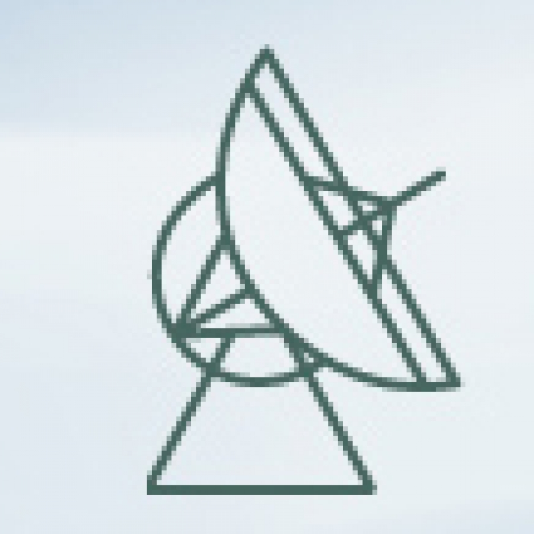

**For a nearly complete list, please check at [<big><big>This Link</big></big>](https://friendshao.github.io/docs/publist), or [ADS](https://ui.adsabs.harvard.edu/#/public-libraries/_Wy76FR4TQutMoiU0wKO_g) / [Inspirehep](https://inspirehep.net/literature?sort=mostrecent&size=500&page=1&q=author%3ALi.Jing.Shao.1#with-citation-summary)**
  
---

### **Selected First-author/Corresponding-author Papers**

0. J. Zhao, P.C.C. Freire, M.  Kramer, **L. Shao**, N. Wex, [Closing a
spontaneous-scalarization window with binary
pulsars](https://arxiv.org/abs/2201.03771), *Class. Quantum Grav.* 39 (2022)
11LT01

0. C. Liu, **L. Shao**, [Neutron star$-$neutron star and neutron star$-$black
hole mergers: multiband observations and early
warnings](https://arxiv.org/abs/2108.08490), *Astrophys. J.* 926 (2022) 158

0. Y. Gao, X.-Y. Lai, **L.  Shao**, R.-X. Xu, [Rotation and deformation of
strangeon stars in the Lennard-Jones model](https://arxiv.org/abs/2109.13234),
*Mon. Not. R. Astron. Soc.* 509 (2022) 2758

0. **L. Shao**, [General relativity withstands double pulsar's
scrutiny](https://physics.aps.org/articles/v14/173), *Physics* 14 (2021) 173

0. Y. Kang, C. Liu, **L. Shao**, [Prospects for detecting exoplanets around
double white dwarfs with LISA and Taiji](https://arxiv.org/abs/2108.01357),
*Astron.  J.* 162 (2021) 247
  - <small>Featured by Kavli Institute for Astronomy and Astrophysics, Peking University:
    [link](http://kiaa.pku.edu.cn/info/1031/7776.htm) 
  

0. Z. Wang, **L. Shao**, C. Liu, [New limits on the Lorentz/CPT symmetry through
fifty gravitational-wave events](https://arxiv.org/abs/2108.02974), *Astrophys.
J.* 921 (2021) 158
  - <small>Featured by School of Physics, Peking University:
    [link](https://mp.weixin.qq.com/s/Cp2NcWvC7Ldi4jbZxLzIsw) 
  

0. X. Miao, H. Xu,  **L.  Shao**, C. Liu, B.-Q. Ma,
  [Stringent tests of gravity with highly relativistic binary pulsars in the era
  of LISA and SKA](https://arxiv.org/abs/2107.05812), *Astrophys. J.* 921 (2021)
  114

0. **L. Shao**, [Combined search for anisotropic birefringence in the
gravitational-wave transient catalog
GWTC-1](https://arxiv.org/abs/2002.01185),
*Phys. Rev. D* 101 (2020) 104019

0. X. Miao, J. Zhao, **L. Shao**, N. Wex, *et al.*, [Tests of conservation
laws in post-Newtonian gravity with binary
pulsars](https://arxiv.org/abs/2006.09652), *Astrophys. J.* 898
(2020) 69

0. **L. Shao**, N. Wex, S.-Y. Zhou, 
  [New graviton mass bound from binary
  pulsars](https://arxiv.org/abs/2007.04531), *Phys. Rev. D* 102 (2020) 024069

0. **L. Shao**, Q.G. Bailey, [Testing the gravitational weak equivalence
principle in the standard-model extension with binary
pulsars](https://arxiv.org/abs/1903.11760), *Phys. Rev. D* 99 (2019)
084017

0. **L. Shao**, Q.G. Bailey, [Testing velocity-dependent CPT-violating
gravitational forces with radio pulsars](https://arxiv.org/abs/1810.06332),
*Phys. Rev. D* 98 (2018) 084049

0. **L. Shao**, N. Wex, M. Kramer,
   [Testing the universality of free fall towards dark matter with radio
   pulsars](https://arxiv.org/abs/1805.08408),
   *Phys. Rev. Lett.* 120 (2018) 241104
  - <small>Featured by PRL editors as an "Editors' Suggestion" [[certificate]](LQ16789.pdf)
   
  - <small>Featured by
    the Max Planck Institute for Radio Astronomy: 
[English](https://www.mpifr-bonn.mpg.de/pressreleases/2018/8) /
[German](https://www.mpifr-bonn.mpg.de/pressemeldungen/2018/8)
   

0. **L. Shao**, B.  Zhang, [Bayesian framework to constrain the photon mass
with a catalog of fast radio bursts](https://arxiv.org/abs/1705.01278),
*Phys. Rev. D* 95 (2017) 123010

0. **L. Shao**, N. Sennett, A. Buonanno, M. Kramer, N. Wex,
    [Constraining nonperturbative strong-field effects in scalar-tensor gravity
    by combining pulsar timing and laser-interferometer gravitational-wave
    detectors](http://arxiv.org/abs/1704.07561), 
    *Phys. Rev. X* 7 (2017) 041025
  - <small>Featured by the Max Planck Institute for Gravitational Physics
    (Albert Einstein
    Institute): [English](http://www.aei.mpg.de/2147555/stronger-tests-of-einstein-s-relativity)
     

0. A. Bohé, **L. Shao**, A. Taracchini, A. Buonanno, *et al.*, 
    [Improved effective-one-body model of spinning, nonprecessing binary black
    holes for the era of gravitational-wave astrophysics with advanced
    detectors](http://arxiv.org/abs/1611.03703), 
   *Phys. Rev. D* 95 (2017) 044028
  - <small>Implemented as the "SEOBNRv4" waveform model in LIGO Algorithm Library
  

0. **L. Shao**, 
    [Testing the strong equivalence principle with the triple pulsar PSR
    J0337+1715](http://arxiv.org/abs/1602.05725), 
    *Phys. Rev. D* 93 (2016) 084023 
  - <small>Featured by PRD editors as an "Editors' Suggestion"
  

0. **L. Shao**, N.  Wex, [Tests of gravitational symmetries with radio
pulsars](https://arxiv.org/abs/1604.03662),
*Sci. China Phys. Mech. Astron.* 59 (2016) 699501

0. **L. Shao**, I.H.  Stairs, *et al.*, [Testing gravity with pulsars in the
SKA era](https://arxiv.org/abs/1501.00058),
*PoS* (AASKA14) 042
  - <small>Chapter in SKA white paper "Advancing Astrophysics with the Square
  Kilometre Array"

0. **L. Shao**, [New pulsar limit on local Lorentz invariance violation of
gravity in the standard-model extension](https://arxiv.org/abs/1412.2320),
*Phys. Rev. D* 90 (2014) 122009

0. **L. Shao**,
    [Tests of local Lorentz invariance violation of gravity in the standard
    model extension](http://arxiv.org/abs/1402.6452), 
    *Phys. Rev. Lett.* 112 (2014) 111103 
  - <small>Featured by School of Physics, Peking University:
    [English](http://www.phy.pku.edu.cn/english/news/140304.xml) / 
    [Chinese](http://www.phy.pku.edu.cn/research/projects/140304.xml)
  

0. **L. Shao**, R.N. Caballero, M. Kramer, *et al.*,
    [A new limit on local Lorentz invariance violation of gravity from solitary
    pulsars](http://arxiv.org/abs/1307.2552),
    *Class. Quantum Grav.* 30 (2013) 165019 
  - <small>Highlighted by Classical and Quantum Gravity [[certificate]](IOP_sck+13.pdf)
  

0. **L. Shao**, N. Wex, 
    [New limits on the violation of local position invariance of
    gravity](http://arxiv.org/abs/1307.2637),
    *Class. Quantum Grav.* 30 (2013) 165020
  - <small>Highlighted by Classical and Quantum Gravity [[certificate]](IOP_sw13.pdf)
  

0. **L. Shao**, N. Wex,
    [New tests of local Lorentz invariance of gravity with small-eccentricity
    binary pulsars](http://arxiv.org/abs/1209.4503),
    *Class. Quantum Grav.* 29 (2012) 215018
  - <small>Highlighted by Classical and Quantum Gravity [[certificate]](IOP_sw12.pdf)
  

0. **L. Shao**, Z. Xiao, B.-Q.  Ma, 
  [Lorentz violation from cosmological objects with very high energy photon
  emissions](https://arxiv.org/abs/0911.2276),
  *Astropart. Phys.* 33 (2010) 312

0. **L. Shao**, B.-Q. Ma,
    [The significant digit law in statistical
    physics](http://arxiv.org/abs/1005.0660),
    *Physica A* 389 (2010) 3109
  - <small>Invited to Wolfram Demonstrations
    Project: [link](http://demonstrations.wolfram.com/BenfordsLawInStatisticalPhysics/)
  
{: reversed="reversed"}

---

### **Selected Collaboration Papers**

[First M87 Event Horizon Telescope
Results](https://iopscience.iop.org/journal/2041-8205/page/Focus_on_EHT) and 
[First Sagittarius A$^\ast$ Event Horizon Telescope
Results](https://iopscience.iop.org/journal/2041-8205/page/Focus_on_First_Sgr_A_Results),
by the **Event Horizon Telescope** Collaboration

[GW170817:
   Observation of Gravitational Waves from a Binary Neutron Star
Inspiral](https://journals.aps.org/prl/abstract/10.1103/PhysRevLett.119.161101),
by the **LIGO Scientific** Collaboration and **Virgo** Collaboration

---

### **Publication Metrics**

| <small> (last updated: May 2022) | **CITATION** | **$H$-FACTOR** | **LINK** |
| **All Papers** | 35,000+ | 59 | [Inspirehep](https://inspirehep.net/literature?sort=mostrecent&size=500&page=1&q=author%3ALi.Jing.Shao.1#with-citation-summary) |
| **Short-author-list Papers** | 2,600+ | 27 | [Inspirehep](https://inspirehep.net/literature?sort=mostrecent&size=250&page=1&q=author%3ALi.Jing.Shao.1%20AND%20not%20cn%3A%2A&ui-citation-summary=true) |

