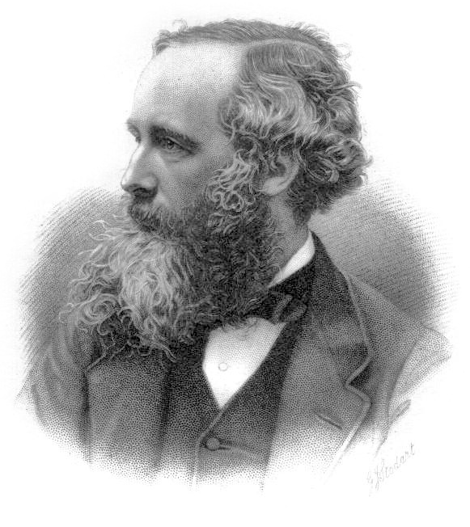

# <b>Classical Electrodynamics (电动力学)</b>

### <u>Spring 2021, Peking University</u>

$$\vec{\nabla} \cdot \vec{D}=\rho, \quad \vec{\nabla} \times \vec{E}=-\frac{\partial \vec{B}}{\partial t}$$
$$\vec{\nabla} \cdot \vec{B}=0, \quad \vec{\nabla} \times \vec{H}=\vec{\jmath}+\frac{\partial \vec{D}}{\partial t}$$

## 课程信息

| **时间** |  |
| **地点** | |
| **期末考试时间** |  |
| **教科书** | **郭硕鸿 [著]，黄逎本、李志兵、林琼桂 [修订]，《电动力学(第三版)》（2008）** |
| **参考书** | J. D. Jackson, *Classical Electrodynamics* (3rd ed), 1999 |
| | 俞允强，《电动力学简明教程》（1999） |
| | D. J. Griffiths, *Introduction to Electrodynamics* (4th ed), 2017 |
| | 郭硕鸿 [著]，黄逎本、方奕忠 [主编]，《电动力学学习辅导书(第三版)》（2009）|
| **教师** | 邵立晶；Office KIAA-217；lshao@pku.edu.cn；010-62758461 | 
| **单号班助教** |  |
| | **习题课**： |
| **双号班助教** | |
| | **习题课**： |

## 课程内容

| **内容** | **作业** | **备注** |
| [0. 课程介绍](https://disk.pku.edu.cn/link/7C039706A3A96522F90B4C7E1CAAA8B6) | | |
| [1. 数学基础](https://disk.pku.edu.cn/link/7C039706A3A96522F90B4C7E1CAAA8B6) | | |
| [2. 电磁现象的普遍规律](https://disk.pku.edu.cn/link/7C039706A3A96522F90B4C7E1CAAA8B6) | | |
| [3. 静电场](https://disk.pku.edu.cn/link/7C039706A3A96522F90B4C7E1CAAA8B6) | | |
| [4. 静磁场](https://disk.pku.edu.cn/link/7C039706A3A96522F90B4C7E1CAAA8B6) | | |
| [5. 电磁波的传播](https://disk.pku.edu.cn/link/7C039706A3A96522F90B4C7E1CAAA8B6) | | |
| **期中考试（闭卷）** |  |  |
| [6. 电磁波的辐射](https://disk.pku.edu.cn/link/7C039706A3A96522F90B4C7E1CAAA8B6) | | |
| [7. 狭义相对论](https://disk.pku.edu.cn/link/7C039706A3A96522F90B4C7E1CAAA8B6) | | |
| [8. 带电粒子和电磁场的相互作用](https://disk.pku.edu.cn/link/7C039706A3A96522F90B4C7E1CAAA8B6) | | |
| **期末考试（闭卷）** | | |

