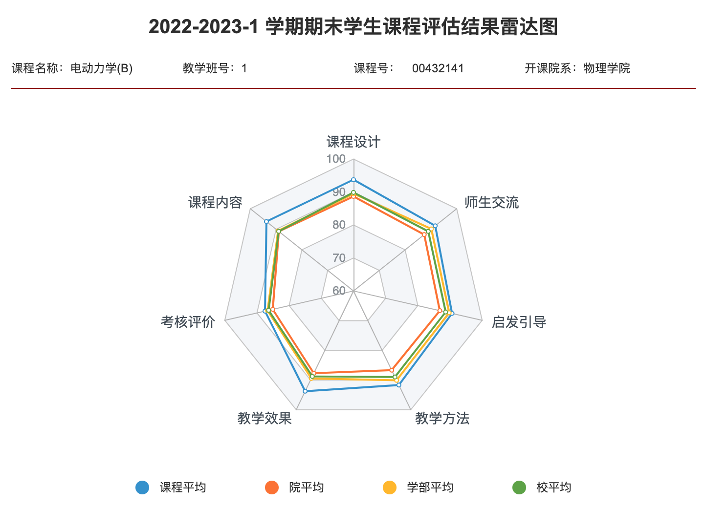

<h2>

*** Notice: links are not maintained after the end of course! 

</h2>

# <b>Classical Electrodynamics (电动力学)</b>

### <u>Fall 2022, Peking University</u>

$$\vec{\nabla} \cdot \vec{D}=\rho, \quad \vec{\nabla} \times \vec{E}=-\frac{\partial \vec{B}}{\partial t}$$
$$\vec{\nabla} \cdot \vec{B}=0, \quad \vec{\nabla} \times \vec{H}=\vec{\jmath}+\frac{\partial \vec{D}}{\partial t}$$

 

### 课程内容

电动力学是物理类各专业的一门重要的基础理论课，课程系统地阐述电磁运动形态的基本规律、电磁场的基本属性及它们和带电物质之间的相互作用，课程还包括介绍狭义相对论。

主要内容有：
- 电磁场的动量、能量；
- 电磁场的运动规律由麦克斯韦方程和洛仑兹力公式描述；
- 介绍了分离变量法、静电镜像法及格林函数方法在静电、静磁中的应用；
- 讨论了电磁波在各种介质中的传播和辐射问题；
- 讨论运动的带电粒子和电磁场的相互作用；
- 阐述狭义相对论产生的历史背景及实际基础、相对论的基本理论及洛仑兹变换，相对论的时空理论等。

## 课程信息

| **时间** |  周一7-8节(单) & 周三3-4节 |
| **地点** | 理教109 |
| **期末考试时间** | 2022年12月21日·上午 |
| **先修课程** | 《电磁学》《理论力学》《数学物理方法》 |
| **教科书** | **俞允强，《电动力学简明教程》（1999）** |
| **参考书** | 郭硕鸿 [著]，黄逎本、李志兵、林琼桂 [修订]，《电动力学(第三版)》（2008） | 
| | 郭硕鸿 [著]，黄逎本、方奕忠 [主编]，《电动力学学习辅导书(第三版)》（2009） |
| | D. J. Griffiths, *Introduction to Electrodynamics* (4th ed), 2017 |
| | J. D. Jackson, *Classical Electrodynamics* (3rd ed), 1999 |
| **教师** | 邵立晶；Office KIAA-217；lshao@pku.edu.cn；010-62758461 | 
| |【答疑时间】每周日14:00-15:00PM（建议来前电话联系，以免空跑） |
| **助教** | 高勇，gaoyong.physics@pku.edu.cn |
| | **习题课**： 周一10-11节(双)；三教308 |

## 课程内容

| **内容** | **备注** |
| 0. 课程介绍 | |
| 1. 数学基础 | [HW1](https://disk.pku.edu.cn:443/link/7B0B8AB7347CF02BF638E114793723AE) (ddl: Sep 21) |
| 2. 经典电动力学基础 | [HW2](https://disk.pku.edu.cn:443/link/7B0B8AB7347CF02BF638E114793723AE) (ddl: Oct 5) |
| <i>课程异动</i> | <i>【9月28日3-4节】改为【9月26日7-8节】，地点不变</i> |
| 3. 静电场 | [HW3](https://disk.pku.edu.cn:443/link/7B0B8AB7347CF02BF638E114793723AE) (ddl: Oct 19) |
| 4. 静磁场 | [HW4](https://disk.pku.edu.cn:443/link/7B0B8AB7347CF02BF638E114793723AE) (ddl: Oct 26) |
| 5. 电磁波的传播 | [HW5](https://disk.pku.edu.cn:443/link/7B0B8AB7347CF02BF638E114793723AE) (ddl: Nov 9) |
| *答疑* | 11月13日·14:00-16:00PM；科维理所K217 | 
| **期中考试（闭卷，笔试）** | 11月14日·随堂；地点：理教109 |
| 6. 电磁波的激发 | [HW6](https://disk.pku.edu.cn:443/link/7B0B8AB7347CF02BF638E114793723AE) (ddl: Nov 30) |
| 7. 狭义相对论 | [HW7](https://disk.pku.edu.cn:443/link/7B0B8AB7347CF02BF638E114793723AE) (ddl: Dec 14)  |
| 8. 带电粒子和电磁场的相互作用 | [HW8](https://disk.pku.edu.cn:443/link/7B0B8AB7347CF02BF638E114793723AE) (ddl: 免交)  |
| *答疑* | 12月20日·14:00-16:00PM；科维理所K217 | 
| **期末考试（闭卷，笔试）** | 12月21日·8:30-10:30AM；地点：理教209 |
| **期末考试：补考（闭卷，笔试）** | 1月9日·14:00-16:00PM | 

## 学生对课程的总体评价

