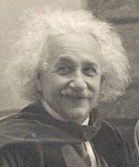

# <b>General Relativity & Astrophysics</b>

### <u>Fall 2020, Peking University</u>

$$R_{\mu\nu} - \frac{1}{2} g_{\mu\nu} R = \frac{8\pi G}{c^4} T_{\mu\nu}$$

<i>“Matter tells spacetime how to curve, and spacetime tells
matter how to move.”</i>

This course is designed to be elementary, suitable for those who want a first
grasp of the **tremendous beauty** of Einstein's general relativity. I will try
to keep the mathematics minimum (*e.g.* the differential geometry), and the
physics clearly stated (*e.g.* the equivalence principle).  In this class,
students are supposed to learn,
0. the logic behind Einstein's general relativity,
0. the ability to derive basic equations,
0. fine interpretation of various phenomena in the relativistic astrophysics,
0. the limitation of the class, 
0. as well as the direction to explore if one wants to master more advanced materials.

Though the class targets graduates who work on astrophysics or theoretical
physics, it is in general eligible for graduate students (as well as the
advanced undergraduates) with *Science & Engineering* background. 

## General Information

| **When & Where** | 周一10-11节（18:40-20:30），二教302 |
| **Prerequisite** | Mathematics, Theoretical Mechanics, Electrodynamics  |
| **Textbook** | **俞允强，《广义相对论引论(第二版)》（1997）**
| **Reference** | Bernard Schutz, *A First Course in General Relativity* (2009) |
| | 陈斌，《广义相对论》（2018） |
| | Matthias Blau, *Lecture Notes on General Relativity* [[link](http://www.blau.itp.unibe.ch/GRLecturenotes.html)] |
| | Charles W. Misner, Kip S. Thorne, & John A. Wheeler, *Gravitation* (1973) |
| | Norbert Straumann, *General Relativity with Applications to Astrophysics* (2004) |
| **Lecturer** | Lijing Shao (邵立晶) | 
| | Office KIAA-217; lshao@pku.edu.cn; 010-62758461 | 
| **Teaching Assistant** | Tai Zhou (周泰) |
| | Office KIAA-103; tai.zhou@pku.edu.cn |

## Contents

| **Content** | **Homework** | **Note** |
| [0. 课程介绍](https://disk.pku.edu.cn/link/39CFA3526A73A5795E8072C784DC57FC) | | |
| [1. 牛顿、麦克斯韦、爱因斯坦](https://disk.pku.edu.cn/link/39CFA3526A73A5795E8072C784DC57FC) | | |
| [2. 狭义相对论](https://disk.pku.edu.cn/link/39CFA3526A73A5795E8072C784DC57FC) | [HW1](https://disk.pku.edu.cn/link/39CFA3526A73A5795E8072C784DC57FC) | HW1 ddl: Oct 19, 2020 |
| [3. 黎曼几何简介](https://disk.pku.edu.cn/link/39CFA3526A73A5795E8072C784DC57FC) |  |  |
| 4. Einstein 场方程 | HW2 | HW2 ddl: Nov 2, 2020 |
| 5. 真空球对称解 | HW3 | |
| 6. 弱场近似与实验检验 |  |  |
| 7. 中子星与黑洞 | HW4 | |
| 8. 引力波简介 | HW5 | |
| 9. 宇宙学简介* | | |
| **期末考试（开卷）** |  | |

