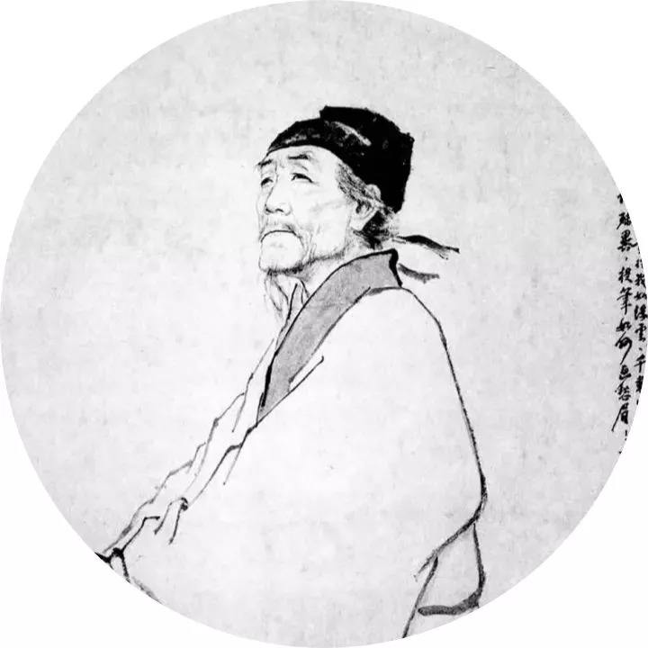

<!-- <h2>

*** Notice: links are not maintained after the end of course! 

</h2> -->

# <b>General Physics I (普通物理 I)</b>

### <u>Spring 2024, Peking University</u>

  《曲江二首 · 其一》 
唐 · 杜甫  
 
一片花飞减却春，风飘万点正愁人。  
且看欲尽花经眼，莫厌伤多酒入唇。  
江上小堂巢翡翠，苑边高冢卧麒麟。  
细推<b>物理</b>须行乐，何用浮名绊此身。  

## 课程信息

- This is a class designed for Freshman students from <b>College of Engineering</b> at Peking University. The contents include
  - **Mechanics** (力学)
  - **Electromagnetism** (电磁学)

<!-- 

&nbsp; &nbsp;

 
-->

| **时间** |  |
| **地点** |  |
| **期末考试时间** |  |
| **教科书** | 钟锡华 & 周岳明，《大学物理通用教程·力学（第二版）》（2010） |
| | 陈秉乾 & 王稼军，《大学物理通用教程·电磁学（第二版）》（2012） |
| **参考书** | 陆果，《基础物理学教程·上卷（第二版）》（2006） |
| | D. Halliday *et al.*，《Fundamentals of Physics (7th Edition)》（2005）|
| **教师** | 邵立晶 | 
| | Office KIAA-217；lshao@pku.edu.cn；010-62758461 | 
| | 【答疑时间】每周日13:30-14:30PM（*建议来前电话联系，以免空跑*） | 
| **单号班助教** | 姬佩祥，2201110290@stu.pku.edu.cn |
| | **习题课:** |
| **双号班助教** |  |
| | **习题课:** |
| <b>网盘链接</b> | [猛戳这里](https://disk.pku.edu.cn:443/link/D86FCF0A773EDD5C29FDA0597FFCD2C2) （倘若打开有误，请尝试重新刷新） |

## 课程内容

| **内容** | **作业** | **备注** |
| 0. 课程介绍 | | |
| 1. 质点运动学 | | |
| 2. 牛顿力学的基本定律 | | |
| 3. 动量变化定理与动量守恒 | HW1 (ddl: ) |  |
| 4. 机械能变化定理与机械能守恒 | | |
| 5. 角动量变化定理与角动量守恒 | HW2 (ddl: ) |  |
| 6. 质心力学定理 | | |
| 7. 刚体力学 | HW3 (ddl: ) |  |
| 8. 振动 | HW4 (ddl: ) |  |
| 9. 波动 | |  |
| 10. 流体力学 | | |
| 11. 哈密顿原理 | HW5 (ddl: ) | 注：第11章作业可以不写 |
| **期中答疑** |  |  科维理所K217 |
| **期中考试**（闭卷、笔试） |  |  |
| 12. 静电场 |  HW6 (ddl: )  | |
| 13. 静电场中的导体和电介质 | HW7 (ddl: ) |  |
| 14. 直流电 |  |  |
| 15. 恒定磁场 | HW8 (ddl: ) | |
| 16. 磁介质 |  |  |
| 17. 电磁感应 | HW9 (ddl: ) | |
| 18. 交流电 | | |
| 19. 麦克斯韦电磁场理论 | HW10 (ddl: ) | 注：第19章作业可以不写 |
| **期末答疑** |  |  科维理所K217 |
| **期末考试**（闭卷、笔试） |  |  |

<!-- ## 文件下载

- **课程日历**：[我爱上课.pdf](https://disk.pku.edu.cn/link/DFD02EC7E930172C5B6B31EF57327843)
- **课程作业**：[我爱写作业.pdf](https://disk.pku.edu.cn/link/DFD02EC7E930172C5B6B31EF57327843)
- **力学讲义**：[电子版.pdf](https://disk.pku.edu.cn/link/DFD02EC7E930172C5B6B31EF57327843)、[手写版.pdf](https://disk.pku.edu.cn/link/DFD02EC7E930172C5B6B31EF57327843)
- **电磁学讲义**：[电子版.pdf](https://disk.pku.edu.cn/link/DFD02EC7E930172C5B6B31EF57327843)、[手写版.pdf](https://disk.pku.edu.cn/link/DFD02EC7E930172C5B6B31EF57327843) -->

<!-- ## 学生对课程的总体评价

 -->

