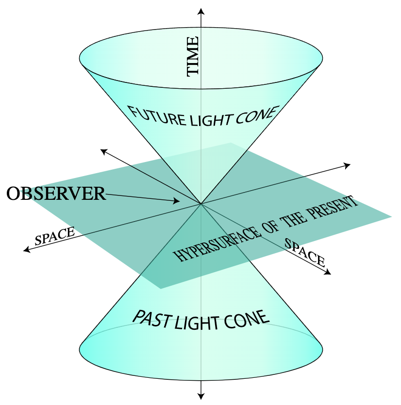
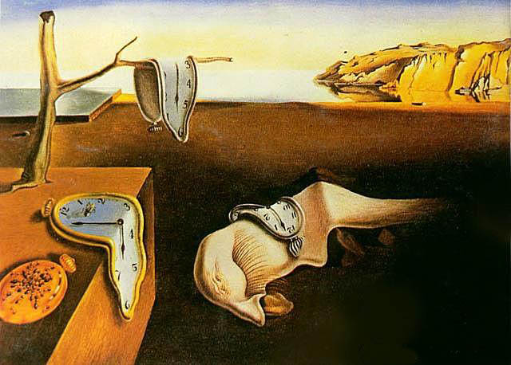
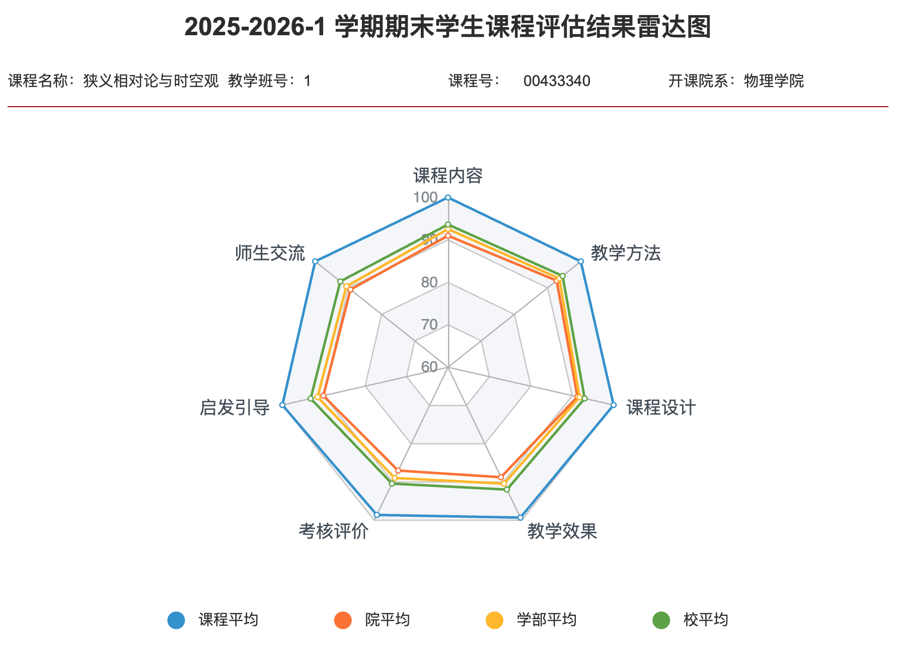

<h2>

*** Notice: links are not maintained after the end of course! 

</h2>

# <b>Special Relativity & Spacetime</b>
## <b>狭义相对论与时空观</b>

### <u>Fall 2025, Peking University</u>

<b>“悟已往之不谏，知来者之可追。”</b>——陶渊明《归去来兮辞》

This course is designed to be introductory, suitable for those who want a first
grasp of the **tremendous beauty** of Einstein's relativity and the modern 
understanding of spacetime. I will try to keep the mathematics minimum, and the
physics clearly stated.  In this class, students are supposed to learn,
0. the concept of spacetime & the history of relativity theories,
0. the logic behind Einstein's special relativity, and the ability to derive basic equations therein,
0. fine interpretation of various phenomena in the spacetime setting,
0. the limitation of the class, as well as the direction to explore if one wants to master more advanced materials.

<b>The Persistence of Memory</b> by <i>Salvador Dalí</i>

Though the class targets undergraduates who, while *not* majoring in Physics,
have basic *Science & Engineering* background, it is in general eligible for
students from other fields with curiosity of the *Nature*, a sense of the
grand *Beauty*, as well as a bit of stubbornness/persistence. 

## General Information

| **课程性质** | 全校公选课 |
| **Space & Time** |  周二10-11节，三教307 |
| **主要面向群体** | 理工科非物理学院和其他感兴趣的本科生 |
| **先修课程** | 高等数学、普通物理 |
| **成绩评定** | 等级制 |
| **参考书** | 《**狭义相对论**(第二版)》，刘辽，费保俊，张允中，科学出版社，2008年 |
| | 《**狭义相对论实验基础**(第二版)》，张元仲，科学出版社，2023年 |
| | 《**从零学相对论**》，梁灿彬，曹周键，高等教育出版社，2013年 |
| | **Special Relativity**，A. P. French，W. W. Norton & Company（1968） |
| | **Introduction to Special Relativity**，Robert Resnick，Wiley（1968）|
| | **Spacetime Physics**，Edwin F. Taylor & John A. Wheeler，W. H. Freeman（1992）|
| **阅读材料** | 《**相对论百问**(第二版)》，赵峥，北京师范大学出版社，2012年 |
| | 《**相对论的意义**》，爱因斯坦 [著]，李灏 [译]，北京大学出版社，2014年 |
| | 《**狭义与广义相对论浅说**》，爱因斯坦 [著]，杨润殷 [译]，北京大学出版社，2006年 |
| **教员** | Lijing Shao (邵立晶)；Office KIAA-217；lshao@pku.edu.cn | 
| | 【答疑时间】每周日14:00-14:45PM（建议来前联系，以免空跑） | 
| **助教** | 张泽，2401110287@stu.pku.edu.cn |
| <b>网盘链接</b> | [猛戳这里](https://disk.pku.edu.cn/link/AADA3F37080DE34F9D85830B93EC78E666) （倘若打开有误，请尝试重新刷新） |

## Contents

| **Content** | **Note** |
| 0. 课程介绍 | |
| 1. 伽利略与牛顿的时空观 | |
| 2. 狭义相对论的基本原理 | |
| 3. 狭义相对论的时空观 |  |
| 4. 相对论性的力学 | 作业（A）；截止时间：11月25日 |
| <b>课程论文</b> | 从**第9周始**到**第16周末**交即可 <small>**要求**：中文 / 正文3000字以内 / 每超100字扣1分</small> |
| 5. 电磁场理论 | |
| 6. 狭义相对论的实验验证 |  |
| 7. 超出狭义相对论的理论与实验探索 |  |
| 8. 广义相对论简介 | 作业（B）；截止时间：12月26日 | 
| <i>期末答疑</i> | |
| <b>期末考试（开卷）</b> | 2025年12月23日·随堂考 |

## 学生对课程的总体评价

