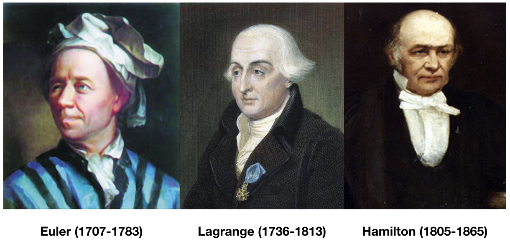

# <b>Theoretical Mechanics (理论力学)</b>

### <u>Fall 2019, Peking University</u>

$$\frac{ {\rm d} }{ {\rm d} t} \frac{\partial L }{\partial \dot q} - \frac{\partial L}{\partial q}  = 0$$
$$\frac{ {\rm d} {\bf p}}{ {\rm d} t} = - \frac{\partial H}{\partial {\bf q}} ~~ \& ~~ \frac{ {\rm d} {\bf q}}{ {\rm d} t} = + \frac{\partial H}{\partial {\bf p}}$$

## 课程信息

| **时间** | 周一 10:10—12:00；周三 8:00—9:50 |
| **地点** | 文史楼119室 |
| **期末考试时间** | 2020年1月8日，上午 |
| **教科书** | **梁昆淼 [原著]，鞠国兴 & 施毅 [修订]《力学(第四版)下册》（2009）** |
| **参考书** | 胡慧玲，林纯镇，吴惟敏，《理论力学基础教程》，1986 [[链接](http://www.phy.pku.edu.cn/~frxu/file/teaching/lilunlixue.pdf)] |
| | 刘川，《理论力学》讲义v1.4 [[链接](ftp://pts.phy.pku.edu.cn/liuchuan/mech_v1.4.pdf)] |
| | 鞠国兴，《理论力学学习指导与习题解析(第二版)》，2018 |
| | H. Goldstein, C. Poole, J. Safko, *Classical Mechanics* (3rd ed), 2002 |
| | L.D. Landau, E.M. Lifshitz, *Mechanics* (3rd ed), 1987 |
| **教师** | 邵立晶 | 
| | Office KIAA-217；lshao@pku.edu.cn；010-62758461 | 
| **助教A** | 刘畅 |
| | 负责单号班，习题课为双周周四7-8节，二教412 |
| | Office KIAA-404；leslielc@pku.edu.cn |
| **助教B** | 高勇 |
| | 负责双号班，习题课为双周周四7-8节，二教308 |
| | Office KIAA-102；gaoyong.physics@pku.edu.cn |

## 课程内容

| **内容** | **作业** | **备注** |
| [0. 课程介绍](https://www.icloud.com/iclouddrive/0kzj3CQg4_QFZYldjKY6r650w#0) | | |
| [1. 矢量力学](https://www.icloud.com/iclouddrive/06VBmcHJdNy-UUat0CBGVeJDg#1) | | |
| 2. 拉格朗日方程 ([partA](https://www.icloud.com/iclouddrive/0l6tgq1-wIfacYVRtknmh4U-g#2)) | [HW1 (45 points)](https://www.icloud.com/iclouddrive/0HkWj5hKYyvxEMyb5DZe26QkQ#homework1) | HW1 deadline: Sept 18 |
| 2. 拉格朗日方程 ([partB](https://www.icloud.com/iclouddrive/0s9qMZOBHs-liZX75m-HH_hXQ#2)) | [HW2 (70 points)](https://www.icloud.com/iclouddrive/0lt5SxPhELU4vEykIfyKC_iFg#homework2) | HW2 deadline: Oct 9 |
| [3. 有心运动](https://www.icloud.com/iclouddrive/0yVZ9Ay7smrY0jIy5e9_-hzyQ#3) | [HW3 (60 points)](https://www.icloud.com/iclouddrive/00K731LwTbLrMO0C8_3Fjh_SA#homework3) | HW3 deadline: Oct 16 |
| [4. 小振动](https://www.icloud.com/iclouddrive/0VXzGO5ttK-6c5raa79LesBaw#4) | [HW4 (55 points)](https://www.icloud.com/iclouddrive/0qEEDdPg_aIZtX0KlWoE7r4sg#homework4)  | HW4 deadline: Oct 28 |
| **期中考试（闭卷）** |   | 2019年11月4日（10:10am），二教102室 |
| [5. 刚体运动学](https://www.icloud.com/iclouddrive/0w5k03IeOuvcvaMdYW8hG35hg#5) | [HW5 (60 points)](https://www.icloud.com/iclouddrive/0y3_8QQcwmbe7HFz1QZSCxmCA#homework5) | HW5 deadline: Nov 6 |
| [6. 刚体动力学](https://www.icloud.com/iclouddrive/0YhtL5rhyWQX1Fj54fKQs9FYQ#6) | [HW6 (150 points)](https://www.icloud.com/iclouddrive/0zjXc_xWOn9xXPuciyWY-3Fqg#homework6) | HW6 deadline: Nov 20 |
| [7. 哈密顿力学](https://www.icloud.com/iclouddrive/0grvVBlNOJIvUX8Imzi7EAuhQ#7) | [HW7 (60 points)](https://www.icloud.com/iclouddrive/00-tvOWdhodrXH6HDD1hTr2uQ#homework7) | HW7 deadline: Nov 27 |
| [8. 力学中的变分方法](https://www.icloud.com/iclouddrive/07uCJ8TPOjOnIA9q6XJNgmj9w#8) | [HW8 (60 points)](https://www.icloud.com/iclouddrive/0qCVex-09umrlriYunDfogAqA#homework8) | HW8 deadline: Dec 4 |
| [9. 连续介质动力学](https://www.icloud.com/iclouddrive/0OfJOmdJXxCVESqJ9dgHCYxHA#9) | [HW9 (60 points)](https://www.icloud.com/iclouddrive/04QRvC5TcMQy1mUeMrfUKTB9w#homework9) | HW9 deadline: Dec 16 |
| [10. 相对论性的分析力学](https://www.icloud.com/iclouddrive/0tfby_METMdkKH8JdjQPRd8Pw#10) | [HW10 (40 points)](https://www.icloud.com/iclouddrive/0dnAIvKjx6PvHO0H3O5uIdYaA#homework10) | HW10 deadline: Dec 25 |
| **期末考试（闭卷）** | [课程小结](https://www.icloud.com/iclouddrive/0t11I0ACD7hG7FrZLxnrS1YoA)  | 2020年1月8日（8:30am） |

