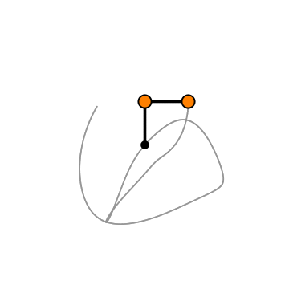

<!-- <h2>

*** Notice: links are not maintained after the end of course! 

</h2> -->

# <b>Theoretical Mechanics (理论力学)</b>

### <u>Spring 2026, Peking University</u>

$$\frac{ {\rm d} }{ {\rm d} t} \frac{\partial L }{\partial \dot q} - \frac{\partial L}{\partial q}  = 0$$
$$\frac{ {\rm d} {\bf p}}{ {\rm d} t} = - \frac{\partial H}{\partial {\bf q}} ~~ \& ~~ \frac{ {\rm d} {\bf q}}{ {\rm d} t} = + \frac{\partial H}{\partial {\bf p}}$$
$$\delta S = 0$$

## 课程信息

| **时间** | 周一1-2节(单) & 周三5-6节 |
| **地点** |  |
| **先修课程** | 《理论物理基础（I）》 |
| **参考书** | **梁昆淼 [原著]，鞠国兴 & 施毅 [修订]《力学(第四版)下册》（2009）** |
| | 刘川，《理论力学》，2019 |
| | H. Goldstein, C. Poole, J. Safko, *Classical Mechanics* (3rd ed), 2002 |
| | L.D. Landau, E.M. Lifshitz, *Mechanics* (3rd ed), 1987 |
| | *鞠国兴，《理论力学学习指导与习题解析(第二版)》，2018* |
| **教师** | 邵立晶；Office KIAA 217；lshao@pku.edu.cn | 
| |【答疑时间】每周日13:30-14:30PM（建议来前联系，以免空跑） |
| **单号班助教** |  胡泽昕，huzexin@pku.edu.cn |
| **双号班助教** |   |
| **习题课** | 周一1-2节(双) |
| <b>网盘链接</b> | [猛戳这里](https://disk.pku.edu.cn/link/AA6ECB2B7DD4C244889D55C713342982DA) （倘若打开有误，请尝试重新刷新） |

## 课程内容

| **内容** | **备注** |
| 0. 课程介绍 | |
| 1. 拉格朗日力学延伸 | HW1 (ddl: ) |
| 2. 哈密顿力学 | HW2 (ddl: ) HW3 (ddl: ) |
| <b>期中考试（闭卷，笔试）</b> |  |
| 3. 连续系统分析力学  | HW4 (ddl: ) |
| 4. 混沌现象  | HW5 (ddl: ) |
| <b>期末考试（闭卷，笔试）</b> |  | 

<!-- ## 学生对课程的总体评价

 -->

