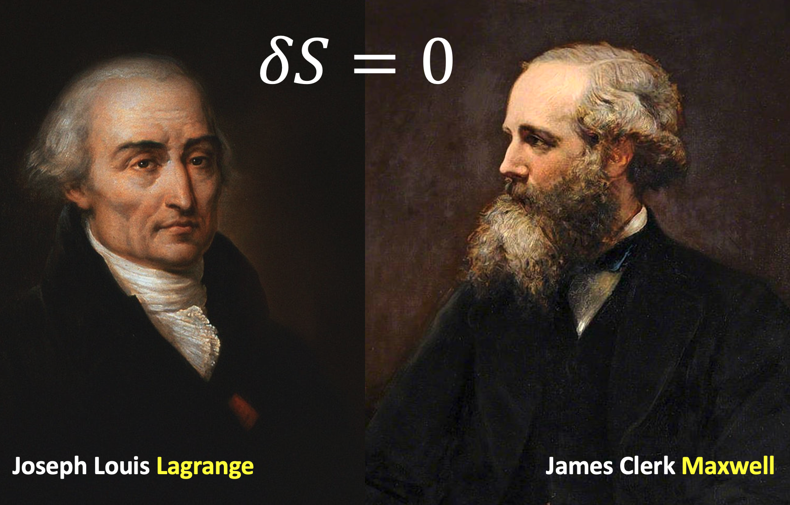

<!-- <h2>

*** Notice: links are not maintained after the end of course! 

</h2> -->

# <b>Fundamentals of Theoretical Physics (I)</b>

### <u>Fall 2025, Peking University</u>

 

 

<b>"Follow me", the wise man said, but he walked behind.</b>

—— Leonard Cohen

 

## 课程内容

**理论物理基础（I）**主要包括两大部分：

0. 拉格朗日和哈密顿的分析力学；
0. 麦克斯韦的经典电磁理论。

Simply speaking, **Fundamentals of Theoretical Physics (I)** includes two parts:

0. Analytic Mechanics;
0. Classical Electrodynamics.

## 课程信息

| **时间** | |
| **地点** | |
| **先修课程** | 《力学》《电磁学》《高等数学》《线性代数》《数学物理方法》 |
| **教科书** | |
| **参考书** | 刘川，《理论力学》，2019；《电动力学》，2023 | 
| | 鞠国兴，《理论力学学习指导与习题解析(第二版)》，2018 |
| | 郭硕鸿 [著]，黄逎本、李志兵、林琼桂 [修订]，《电动力学(第三版)》，2008 | 
| | 郭硕鸿 [著]，黄逎本、方奕忠 [主编]，《电动力学学习辅导书(第三版)》，2009 |
| | H. Goldstein, C. Poole, J. Safko, Classical Mechanics (3rd ed), 2002 |
| | J. D. Jackson, *Classical Electrodynamics* (3rd ed), 1999 |
| **教师** | 邵立晶；Office KIAA-217；lshao@pku.edu.cn | 
| |【答疑时间】每周日13:30-14:30PM（建议来前联系，以免空跑） |
| **单号助教** | |
| **双号助教** | |
| **习题课** | |
| <b>网盘链接</b> | [猛戳这里](TBA) （倘若打开有误，请尝试刷新） |

## 课程内容

| **内容** | **备注** |
| 0. 课程介绍 | |

<!-- ## 学生对课程的总体评价

 -->

